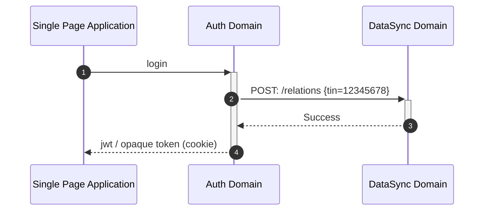

# Data Sync Domain

# Create relations

## Request

```text
POST /relations

{
    "ssn": null,
    "tin": 12345678
}
```

## Parameters

- ssn: Social security number
- tin: Company tin number

***ssn and tin are mutual exclusive, one must be set.***

## Response

```json
{
    "success": true
}
```

## Internal call structure



# Get Metering points


## Request

```text
GET /meteringpoints
```

## Parameters

\-

## Response

```json
{
    "meteringpoints": [
        {
            "gsrn": 57131300000000001
        }
    ]
}
```


# Get Measurements

## Request

```text
GET /measurements
    ?gsrn=123;456;789
    &dateFrom=1514826000
    &dateTo=1514864000
```

## Parameters

- gsrn: 18 digit integer id(GSRN) of a meteringpoint, multiple can be seperated with ;
- dateFrom: [UNIX timestamp](conventions.md#date-from-and-to)
- dateTo: [UNIX timestamp](conventions.md#date-from-and-to)


## Response

```json
{
    "measurements": [
        {
            "gsrn": 57131300000000001,
            "dateFrom": 1514826000,
            "dateTo": 1514864000,
            "quantity": 1865880,
            "quality": 10
        },...
    ]
}
```

Quality enum:
    Measured = 10
    Revised = 20
    Calculated = 30
    Estimated = 40