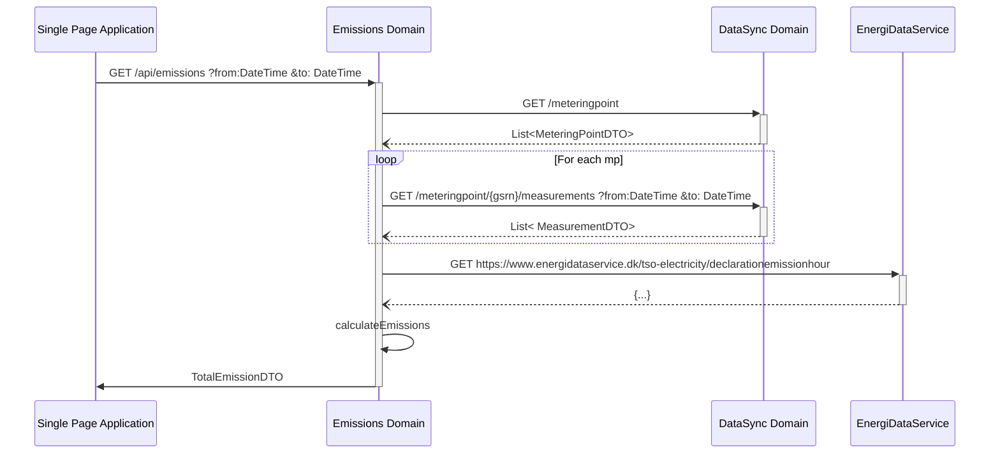
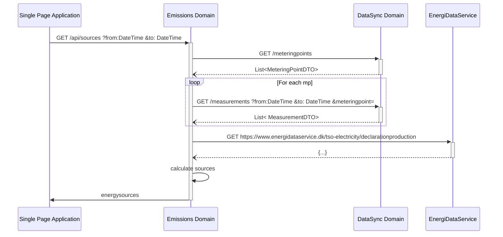

# Emissions domain

# Get emissions

The emissions api should take three query parameters

## Request

```text
GET /api/emissions
        ?dateFrom=1514826000
        &dateTo=1514864000
        &aggregation=TOTAL   
```

## Parameters

- dateFrom: [UNIX timestamp](best-practices.md#date-from-and-to)
- dateTo: [UNIX timestamp](best-practices.md#date-from-and-to)
- aggregation: [aggregation ENUM](best-practices.md#aggregation)

## Response

```json
{
    "emissions": [
        {
            "dateFrom": 1514826000, 
            "dateTo": 1514864000,  
            "co2": 1241245534.213
        }
    ]
  
}
```


## Internal call structure

[Link to EDS](https://www.energidataservice.dk/tso-electricity/declarationemissionhour)




# Get Sources of Energy

This endpoint returns the personal mix of energy for the period.
## Request

```text
GET /api/sources
        ?dateFrom=1514826000
        &dateTo=1514864000
        &aggregation=TOTAL   
```

## Parameters

- dateFrom: [UNIX timestamp](best-practices.md#date-from-and-to)
- dateTo: [UNIX timestamp](best-practices.md#date-from-and-to)
- aggregation: [aggregation ENUM](best-practices.md#aggregation)

## Response

```json
{
    "energysources": [
        {
            "dateFrom": 1514826000, 
            "dateTo": 1514864000, 
            "renewable": 0.69,
            "source" : {
                "wood": 0.12,
                "waste": 0, 
                "straw": 0,
                "oil": 0,
                "natural-gas": 0,
                "coal": 0.05,
                "biogas": 0,
                "solar": 0,
                "wind-onshore": 0,
                "wind-offshore": 0.56
            }
        }
    ]
}
```

## Internal call structure

[Link to EDS](https://www.energidataservice.dk/tso-electricity/declarationproduction)


