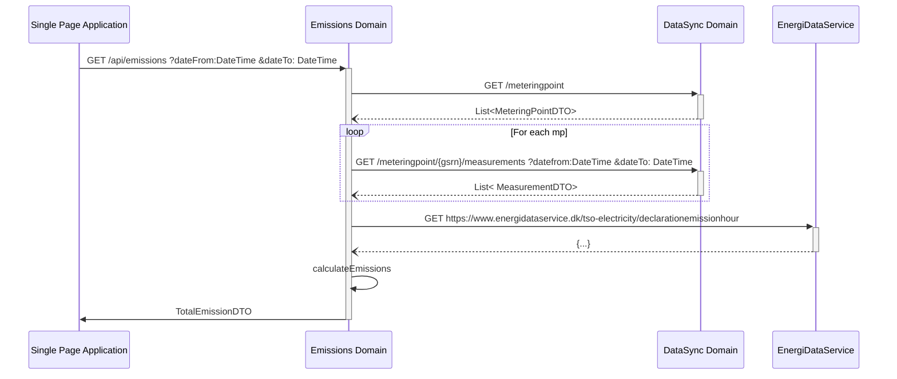
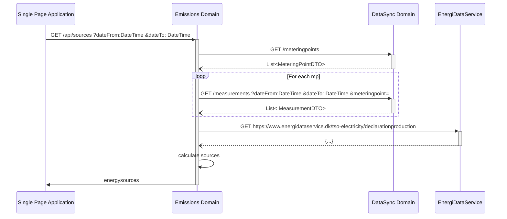

# Emissions domain

# Get emissions

The emissions api should take three query parameters

## Request

```text
GET /api/emissions
        ?dateFrom=1514826000
        &dateTo=1514864000
        &aggregation=TOTAL   
```

## Parameters

- dateFrom: [UNIX timestamp](best-practices.md#date-from-and-to)
- dateTo: [UNIX timestamp](best-practices.md#date-from-and-to)
- aggregation: [aggregation ENUM](best-practices.md#aggregation)

## Response

```json
{
    "emissions": [
        {
            "dateFrom": 1514826000, 
            "dateTo": 1514864000,  
            "total": {
                "co2": 1241245534.213   //g
            },
            "relative": {
                "co2": 1234.213   // g/kWh
            }
        }
    ]
}
```

sum-agg is Sum for each "bucket" in the aggregation level selected.

total values are in grams = sum-agg(comsumption * eds)
relative is in grams/kwh = total / sum-agg(consumption)

### Example calculation

**Values from EDS**

| Hour | PriceZone | CO2 g/kwh | NOx g/kwh |
|------|-----------|-----------|-----------|
| 1    | DK1       | 124       | 12        |
| 2    | DK1       | 234       | 15        |
| 3    | DK1       | 85        | 2         |
| 4    | DK1       | 120       | 8         |

**Values from DataSync**
| Hour | PriceZone | Consumption wh |
|------|-----------|----------------|
| 1    | DK1       | 1234           |
| 2    | DK1       | 242            |
| 3    | DK1       | 654            |
| 4    | DK1       | 1800           |

**aggregationSize = 2**

**Woring table total**

| Hour | CO2 g   | NOx g  |
|------|---------|--------|
| 1    | 153,016 | 14,808 |
| 2    | 56,628  | 3,63   |
| 3    | 55,59   | 1,308  |
| 4    | 216     | 14,4   |

**Total for bucket**
| Bucket | CO2 g   | NOx g  |
|--------|---------|--------|
| 1+2    | 209,644 | 18,438 |
| 3+4    | 271,59  | 15,708 |

**Relative for bucket**
| Bucket | CO2 g/kwh  | NOx g/kwh  |
|--------|------------|------------|
| 1+2    | 142,03523  | 12,4918699 |
| 3+4    | 110,672372 | 6,400978   |


## Internal call structure

[Link to EDS](https://www.energidataservice.dk/tso-electricity/declarationemissionhour)




# Get Sources of Energy

This endpoint returns the personal mix of energy for the period.
## Request

```text
GET /api/sources
        ?dateFrom=1514826000
        &dateTo=1514864000
        &aggregation=TOTAL   
```

## Parameters

- dateFrom: [UNIX timestamp](best-practices.md#date-from-and-to)
- dateTo: [UNIX timestamp](best-practices.md#date-from-and-to)
- aggregation: [aggregation ENUM](best-practices.md#aggregation)

## Response

```json
{
    "energysources": [
        {
            "dateFrom": 1514826000, 
            "dateTo": 1514864000, 
            "renewable": 0.69,
            "source" : {
                "wood": 0.12,
                "waste": 0, 
                "straw": 0,
                "oil": 0,
                "natural-gas": 0,
                "coal": 0.05,
                "biogas": 0,
                "solar": 0,
                "wind-onshore": 0,
                "wind-offshore": 0.56
            }
        }
    ]
}
```

## Internal call structure

[Link to EDS](https://www.energidataservice.dk/tso-electricity/declarationproduction)


