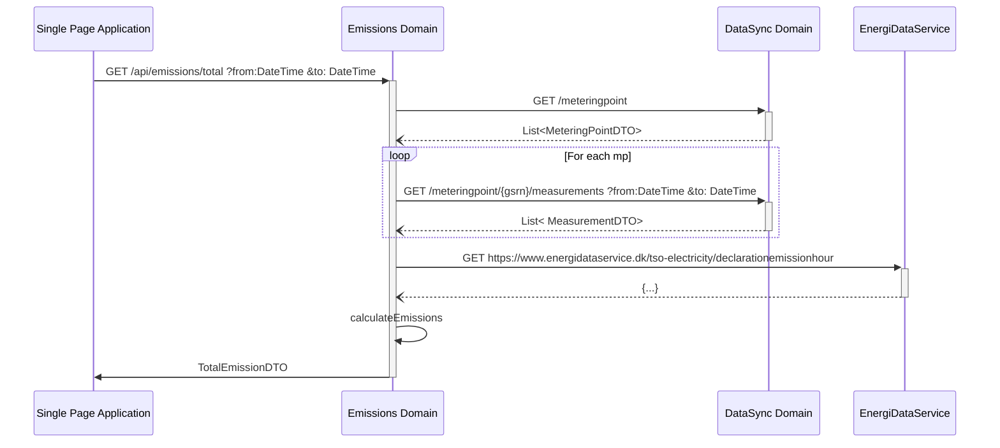

# Emissions domain

# Get emissions

The emissions api should take three query parameters

## Request

```text
GET /api/emissions
        ?dateFrom=1514826000
        &dateTo=1514864000
        &aggregation=TOTAL   
```

## Parameters

- dateFrom: [UNIX timestamp](best-practices.md#date-from-and-to)
- dateTo: [UNIX timestamp](best-practices.md#date-from-and-to)
- aggregation: [aggregation ENUM](best-practices.md#aggregation)

## Response

```json
{
    "emissions": [
        {
            "dateFrom": 1514826000, 
            "dateTo": 1514864000,  
            "co2": 1241245534.213
        }
    ]
  
}
```


## Internal call structure

[Link to EDS](https://www.energidataservice.dk/tso-electricity/declarationemissionhour)


