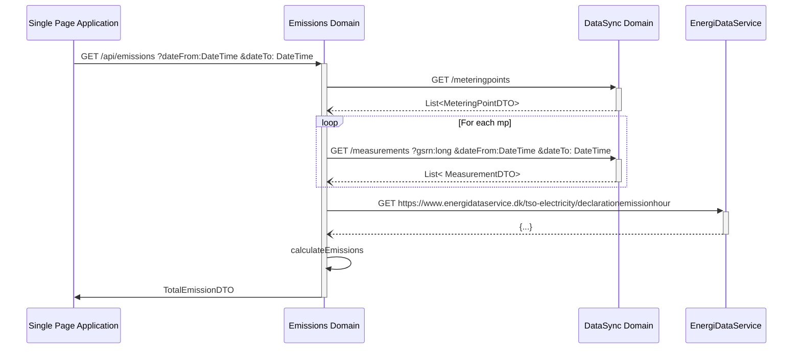
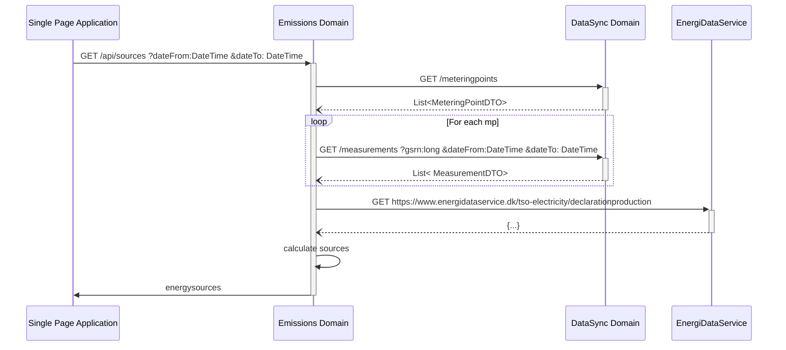

# Emissions domain

# Get emissions

The emissions api should take three query parameters

## Request

```text
GET /api/emissions
        ?dateFrom=1514826000
        &dateTo=1514864000
        &aggregation=TOTAL
```

## Parameters

- dateFrom: [UNIX timestamp](conventions.md#date-from-and-to)
- dateTo: [UNIX timestamp](conventions.md#date-from-and-to)
- aggregation: [aggregation ENUM](conventions.md#aggregation)

## Response

```json
{
    "emissions": [
        {
            "dateFrom": 1514826000,
            "dateTo": 1514864000,
            "total": {
                "value": 1241245534.213,
                "unit": "g"
            },
            "relative": {
                "value": 1234.213,
                "unit": "g/kWh"
            }
        }
    ]
}
```

sumAgg is Sum for each "bucket" in the aggregation level selected.

total values are in grams = sumAgg(comsumption * eds)
relative is in grams/kwh = total / sumAgg(consumption)

### Example calculation

**Values from EDS**

| Hour             | PriceZone | CO2 g/kwh | NOx g/kwh |
|------------------|-----------|-----------|-----------|
| 2021-01-01T22:00 | DK1       | 124       | 12        |
| 2021-01-01T23:00 | DK1       | 234       | 15        |
| 2021-01-02T00:00 | DK1       | 85        | 2         |
| 2021-01-02T01:00 | DK1       | 120       | 8         |

**Values from DataSync**
| Hour             | PriceZone | Consumption wh |
|------------------|-----------|----------------|
| 2021-01-01T22:00 | DK1       | 1234           |
| 2021-01-01T23:00 | DK1       | 242            |
| 2021-01-02T00:00 | DK1       | 654            |
| 2021-01-02T01:00 | DK1       | 1800           |

**Working table total**

| Hour             | CO2 g   | NOx g  |
|------------------|---------|--------|
| 2021-01-01T22:00 | 153,016 | 14,808 |
| 2021-01-01T23:00 | 56,628  | 3,63   |
| 2021-01-02T00:00 | 55,59   | 1,308  |
| 2021-01-02T01:00 | 216     | 14,4   |

**aggregationSize = DAY**

**Total for bucket**
| Bucket     | CO2 g   | NOx g  |
|------------|---------|--------|
| 2021-01-01 | 209,644 | 18,438 |
| 2021-01-02 | 271,59  | 15,708 |

**Relative for bucket**
| Bucket     | CO2 g/kwh  | NOx g/kwh  |
|------------|------------|------------|
| 2021-01-01 | 142,03523  | 12,4918699 |
| 2021-01-02 | 110,672372 | 6,400978   |


## Internal call structure

[Link to EDS](https://www.energidataservice.dk/tso-electricity/declarationemissionhour)




# Get Sources of Energy

This endpoint returns the personal mix of energy for the period.
## Request

```text
GET /api/sources
        ?dateFrom=1514826000
        &dateTo=1514864000
        &aggregation=TOTAL
```

## Parameters

- dateFrom: [UNIX timestamp](conventions.md#date-from-and-to)
- dateTo: [UNIX timestamp](conventions.md#date-from-and-to)
- aggregation: [aggregation ENUM](conventions.md#aggregation)

## Response

```json
{
    "energySources": [
        {
            "dateFrom": 1514826000,
            "dateTo": 1514864000,
            "renewable": 0.68888,
            "ratios" : {
                "wood": 0.12222,
                "waste": 0.00000,
                "straw": 0.00000,
                "oil": 0.00000,
                "naturalGas": 0.00000,
                "coal": 0.05000,
                "bioGas": 0.00000,
                "solar": 0.00000,
                "windOnshore": 0.00000,
                "windOffshore": 0.56666
            }
        }
    ]
}
```
Ratios are returned with 5 fractional digits. Due to rounding the sum might not add up to one.

## Internal call structure

[Link to EDS](https://www.energidataservice.dk/tso-electricity/declarationproduction)


