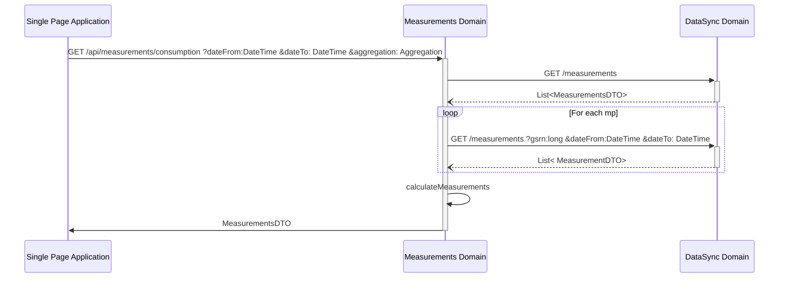

# Measurements domain

# Get Measurements for consumption data

The measurements api should take three query parameters.


## Request

```text
GET /api/measurements/consumption
        ?dateFrom=1514826000
        &dateTo=1514864000
        &aggregation=TOTAL   
```

## Parameters

- dateFrom: [UNIX timestamp](conventions.md#date-from-and-to)
- dateTo: [UNIX timestamp](conventions.md#date-from-and-to)
- aggregation: [aggregation ENUM](conventions.md#aggregation)

## Response

```json
{
    "consumption": [
        {
            "dateFrom": 1514826000, 
            "dateTo": 1514864000, 
            "value": 123154
        }
    ]
}
```

## Internal call structure


