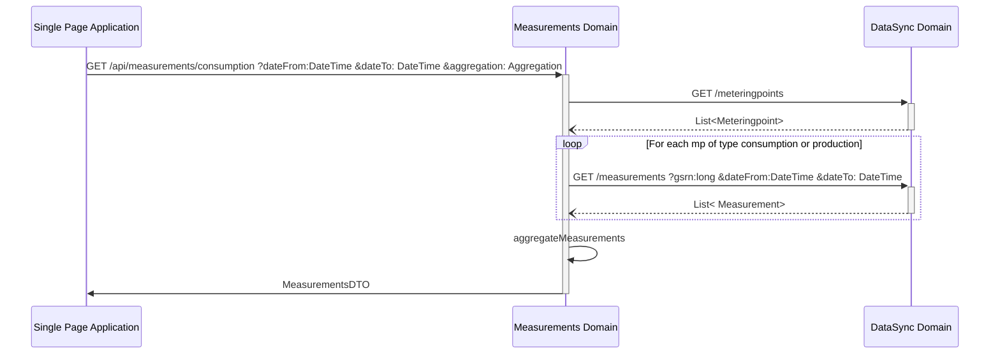
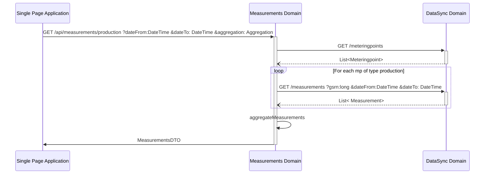

# Measurements domain

# Get Measurements for consumption and production data

The measurements api should take three query parameters and returns a date from, to and a value given in Wh.

## Request

```text
GET /api/measurements/consumption
        ?dateFrom=1514826000
        &dateTo=1514864000
        &aggregation=TOTAL
```
```text
GET /api/measurements/production
        ?dateFrom=1514826000
        &dateTo=1514864000
        &aggregation=TOTAL
```

## Parameters

- dateFrom: [UNIX timestamp](conventions.md#date-from-and-to)
- dateTo: [UNIX timestamp](conventions.md#date-from-and-to)
- aggregation: [aggregation ENUM](conventions.md#aggregation)

## Response

```jsonc
{
    "measurements": [
        {
            "dateFrom": 1514826000, // as unix time stamp 
            "dateTo": 1514864000, // as unix time stamp 
            "value": 123154 // in Wh
        }
    ]
}
```

## Internal call structure

### GET /api/measurements/consumption


### GET /api/measurements/production

