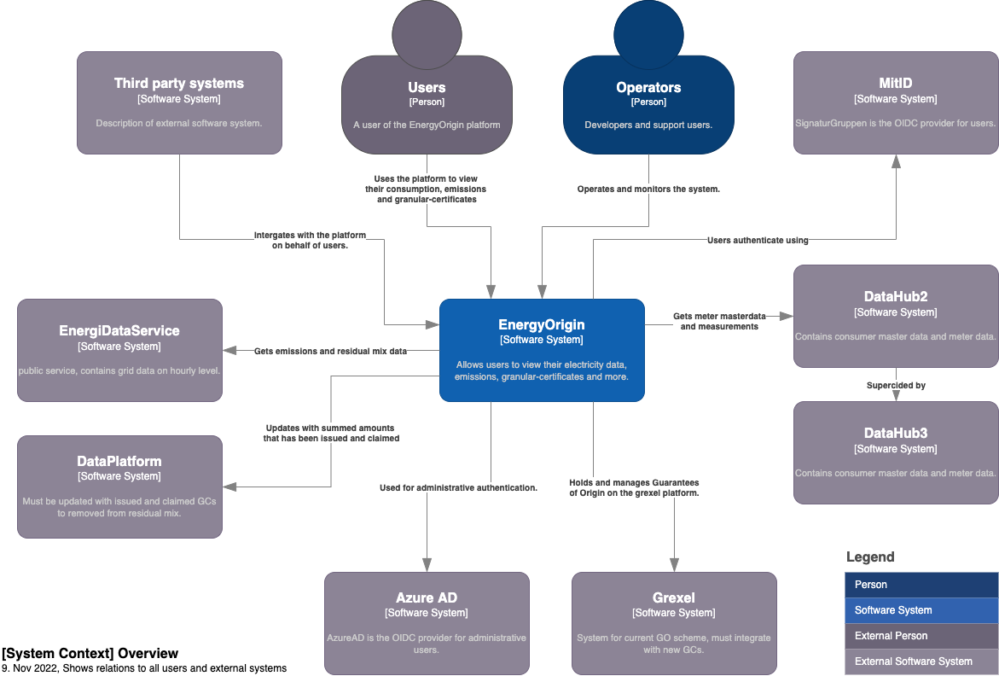
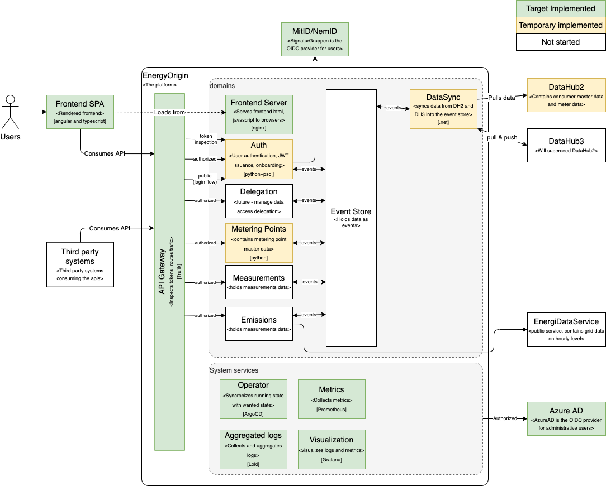

# Platform Architecture Specification

This document contains the overall architecture of the EnergyOrigin platform

## Intended readers and confidentiality

This document is intended for Architects and Developers
using and building the platform.

This document is public as it is a part of the OpenSource project
called EnergyOrigin.
  
---

## Architecture Overview

This chapter describes the background of our architecture, its purposes,
constraints and high level architecture.

### Motivation

As part of the Green transition in the energy sector Granular Certificates are
becoming a central part of the puzzle to solve the ever growing need to be able
to document the green and/or renewable aspect of energy.

The changes in how energy is handled and consumed is changing in an increasing
manner, so a platform that can handle these challenges are needed to enable the
green transition.

### Architectural Goals and Constraints

The goal of the architecture is to:

- **Platform**: create an extendable platform where individual domains are
loosely coupled, to enable domains to be added, replaced or removed.

- **Isolated Domains**: the platform isolates groups of services into domains,
each domain can have a larger responsibility than a single service.
**No changes** required to other domains.

### System Business Requirements and Constraints

Business requirements:

- **OpenSource**: the platform must be OpenSource and a community created around it.
This will enable a shared benefit over time.

- **Avoid vendor lock-in**: The platform should not be limited by proprietary third-party
software to avoid vendor lock in.

- **Cloud Agnostic**: The platform should be able to run on any cloud or on-premise to not
limit it to specific users who only use one cloud provider.

---

## Design Requirements

- **Secure by design**: At every point during the design of the system,
security must be considered.

- **Privacy by design (GDPR)**: The platform must have built in support
to enable users to get their data and be deleted on request without manual steps.

- **Use existing IAM or external authentication**:
The platform must enable the use of OAuth2 and OIDC for user authentication
of normal users and OIDC to existing IAM for administrative users.

---

## Design Decisions

- [ADR-0001 Cloud Native First](adr/0001-cloud-native.md)
- [ADR-0002 IaC & GitOps](adr/0002-gitops.md)
- [ADR-0003 Event store and CQRS](adr/0003-event-store.md)
- [ADR-0004 Domains](adr/0004-domains.md)
- [ADR-0005 Delegate](adr/0005-delegation.md)
- [ADR-0006 Authentication](adr/0006-authentication.md)
- [ADR-0007 Secrets](adr/0007-secret-storage.md)
- [ADR-0008 Monorepo](adr/0008-monorepo.md)

### Design Patterns & Principles

Event sourcing and [CQRS](https://martinfowler.com/bliki/CQRS.html) (Command Query Responsibility Segregation)
are at the core of the platform.
The design is to store data as events in a shared Event Store shared between domains.
Individual domains can then be added, updated and removed with low coupling.

A new domain can be created and brought up to speed based on the Event Store.
This removes the need for inter domain calls to pull and migrate data from other domains when domains are added or updated.

---

## Test Strategy

All code must be sufficiently tested by unit and integrations tests,
so that the developers feel safe when deploying without any gates to production.

All manual tests will be regarded as tech-debt.

---

## Architecture overview

The diagrams below are documented based on [arc42](https://docs.arc42.org/section-5/)

### High Level context diagram

Context diagram, high level overview of the system that will be part of the Danish deployment.

The blue is the platform itself.
Green are systems that has been integrated to.
Yellow are expected future integrations.

## EnergyOrigin internals

This view explores how the different components that the platform is build from
integrates with each other.

## Domains

Below is a list of the domains and a reference to their documentation.

*TODO: document missing domains.*

- [Measurement](domains/measurements.md)
