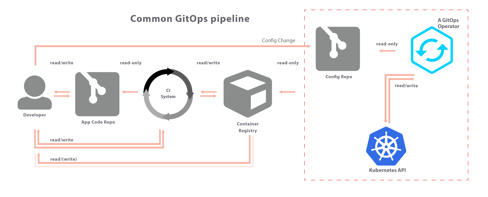

# DevOps - IaC & GitOps

* Status: accepted
* Deciders: @MartinSchmidt
* Date: 2021-07-01

---

## Context and Problem Statement

When developing and operating a system or platform,
one has to consider how one intends to handle ones Continuous Delivery
and configuration of the environment.

---

## Considered Options

* IaC - infrastructure as code
* [CIOps](https://www.weave.works/blog/kubernetes-anti-patterns-let-s-do-gitops-not-ciops)
* [GitOps](https://www.weave.works/blog/kubernetes-anti-patterns-let-s-do-gitops-not-ciops)

---

## Decision Outcome

The platform will use **IaC** and **GitOps**.

---

## Rationale

In IaC, infrastructure configuration is stored as code,
this ensures that the processes are reproducible and repeatable.

In GitOps **all** infrastructure and deployments are defined in a Git repository.

Storing all of this in a Git repository enabled full **transparency and traceability**
in what state the platform is in.

In GitOps a **Operator** is used to keep the environment in sync with the repository.
This operator continually monitors both the environment *(running state)* and the
git repository *(wanted state)*, if the states drift from each other, the operator
will correct the *running state* towards the *wanted state*.

This removed the possibility to perform changes into the environment without
changing the repository.

This in turn changes the old behavior in many Operation teams,
*perform change -> document change* where the last part not always happens,
to *document change in git* and the system automatically updated the *running state*
to the *wanted state*

### Positive Consequences

* All changes to the environment are document in a permanent history in a Git repository.
* Changes to the environment can be gated behind pull-requests to ensure the team or other
parties agree with the changes.
* No direct access to the environment for developers or operations.
* Pull-based deployment greatly limits what services require admin privileges to the cluster.

### Negative Consequences

* Configuration of environment up until the operator is running requires to be push-based.
