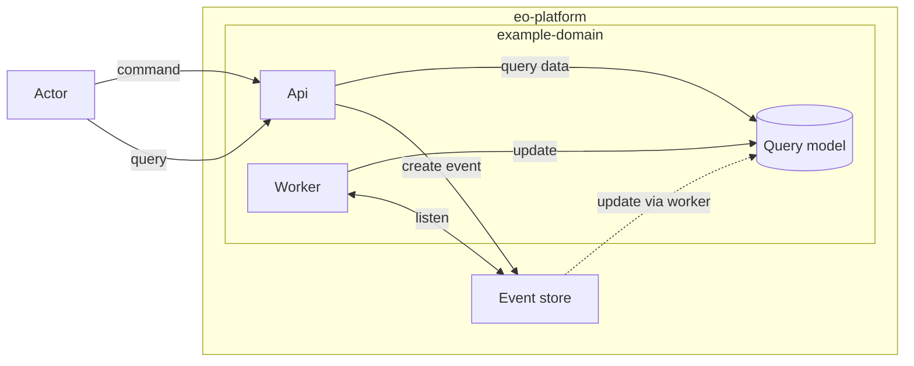

# Domains

* Status: accepted
* Deciders: @MartinSchmidt
* Date: 2021-07-01

---

## Context and Problem Statement

How to isolate services that built a set of features into groups with a clean isolation.

---

## Decision Outcome

The system will be divided into **domains**, each domain consisting of **multiple services**.

---

## Rationale

Based on [ADR0003 Event and CQRS](0003-event-store.md) the system will use CQRS.

To enable the platform to segregate command and query model into separate services
a domain terminology to encapsulate these will be used to reference a group of
services used to enable a specific feature in the platform.

Example domain consisting of multiple services:

