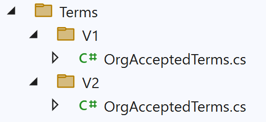

# Intergration events

* Status: Accepted
* Deciders: @tnickelsen, @ckr123, @sahma, @TopSwagCode
* Date: 2024-07-03

---

## Context and Problem Statement

A loosely coupled system is a design goal for the overall system. One way to achieve this is by favoring  the publish / subscribe pattern over synchronize communication. With the introduction of publish / subscribe there is a need to establish a common way to implement this pattern. Without a common set of rules every subscriber would have to implement logic that could handle all variants of messages from different publishers.

---

## Decision Outcome

This document contains the requirements that all publishers must follow.

### Defining integration events

All integration events are defined as C# objects in the Integration events nuget package. To subscribe, a reference must be made to this nuget package.

#### Event data

When creating a new integration event the new event must inherrit from the abstract IntegrationEvent class to ensure we have the following parameters on the event:

* Id: Id of the event. Can be used to uniquely identify the event.

* TraceId: TraceId used to trace the event

* Created: Creation date and time.

#### Versioning

When a contract is made public available it's considered final. This means that all future modifications to the contract must be backwards compatible. You are allowed to add new fields to a contract. Ordering of fields, data types, removal of fields etc. are considered breaking changes. If a breaking change is unavoidable then the contract must be duplicated and given a new namespace. The namespace of the new version is bumped as shown here:

#### Event naming

When choosing a name for an event it should be clear what the intent is. The consumer of an event can expect to get all data related to the event - no need to contact the sending party to get the remaining data. A message name should follow the pattern <entity><verb-in-past-tens>.

Examples:

* OrgTermsAccepted

* MeteringPointConnected

* EnergyConsumptionMeasured

### Distributing integration events

We use RabbitMq as our message queue.

## Design for idempotent

The same message will eventual end up being delivered more then once. The consumer of the message should be able to handle this situation.

A way to handle this could be with the use of Id of the integration event.
