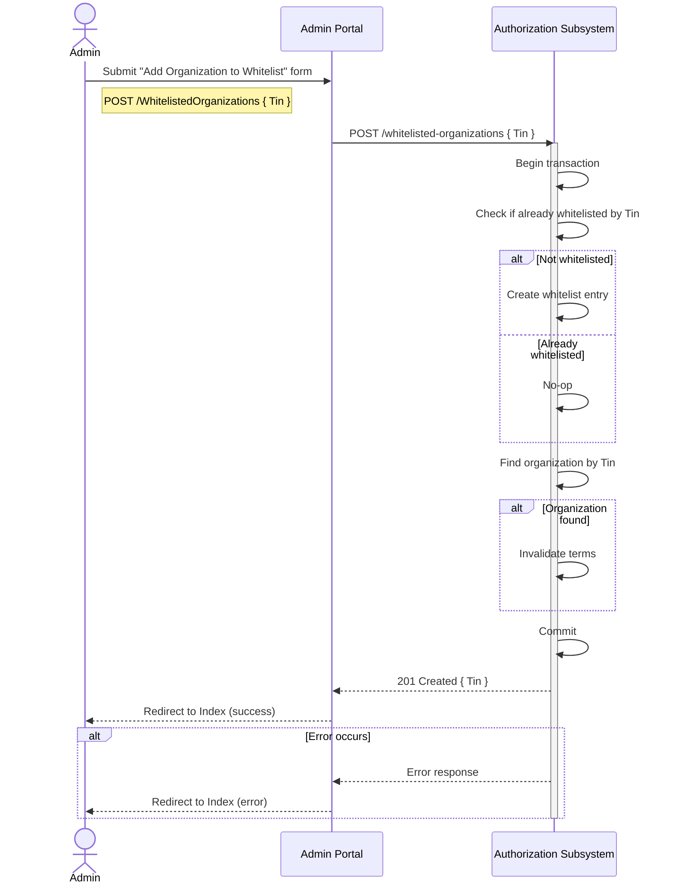
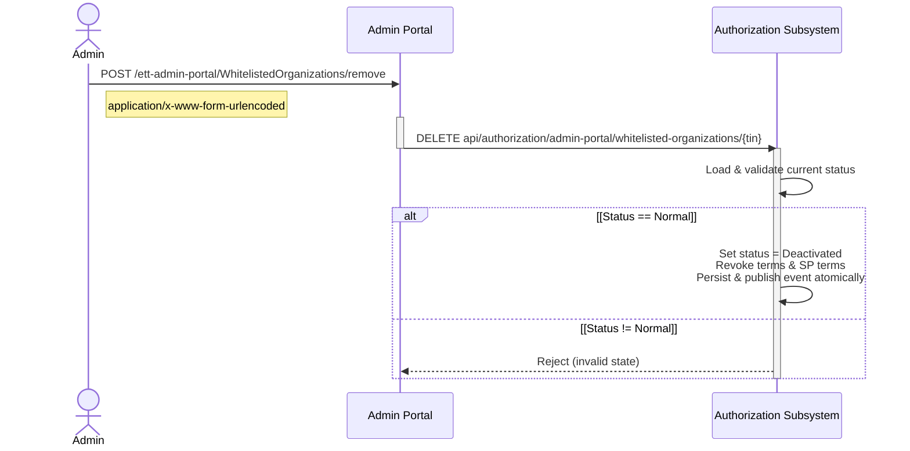

# Admin Portal

## Overview

The Admin Portal is the operator UI for Energy Track & Trace.
It provides controlled workflows for Organization Management, and metering-points management.
The portal does not own data, and never interfaces directly with our datastores;
All calls go through upstream subsystems that own the data.
Only workflows that modify data are documented with sequence diagrams.

## Workflows

### Add Organization to Whitelist

This is done by an Admin through the Admin Portal.
The Admin submits a form to add an organization to the whitelist.
A whitelist record is created if absent,
and it invalidates the organization’s accepted terms if present, and commits atomically.
Returns 201 Created on success; errors are surfaced to the portal for redirect and messaging.

### Deactivate Organization / Remove from Whitelist

This is done by an Admin through the Admin Portal.
The Admin submits a form to remove an organization from the whitelist.
The Authorization service validates current status;
if Normal, it sets status to Deactivated, revokes terms and SP terms, and persists and publishes the change atomically.
Other states are rejected.

