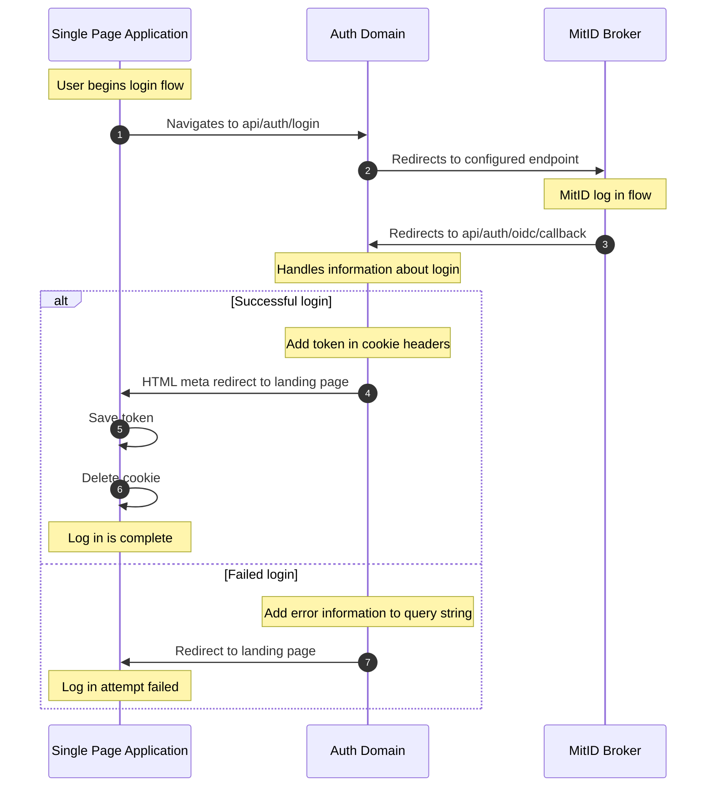
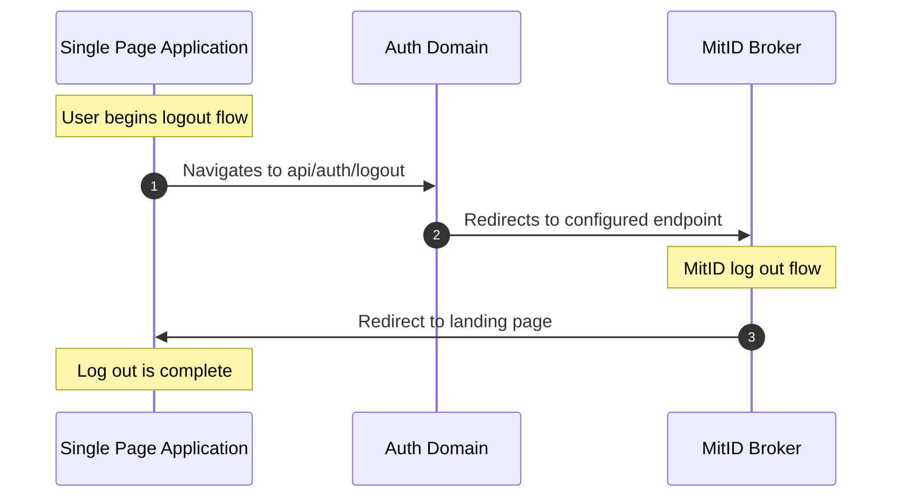

# Auth Domain

## Container diagram


## Old endpoints

There is a description of the current endpoints available at [Auth API](../../api/auth.md).

## Tokens

Tokens relays both user details and related information to each domain, so no domain has to ask for additional information.

```jsonc
{
  "sub": "1234567890",
  "name": "John Doe",
  "iat": 1516239022,
  "scope": "certificates fun jokes",
  //...
}
```

Neither developer tokens nor OIDC PKCE type tokens are included in the current description.

## Terms

Terms are defined in the base environment. These will be used both in the frontend domain and the auth domain.

The frontend domain will present the HTML and to do so will have the latest terms markdown convert into HTML and placed in an agreed upon location.

The auth domain will be configured with the latest version and can check if a user has accepted the latest version or not.
Based on this the claim relating to terms for the front-facing token can be calculated.

## Flows

An overview of the important flows that needs to be understood.

### Log in



### Log out



## New endpoints

### `GET /api/auth/login`
---

Starts the login flow with OIDC provider.

**Response**

HTTP 307 redirect

### `GET /api/auth/oidc/callback`
---

Handle callback from OIDC provider by redirecting to:
- landing page
- login failure page with error code

**Query Parameters**

- state: State provided when starting flow
- code: Code for retrieving tokens
- error: Error response
- error_description: Text description of the error

**Response**

HTTP 200 OK with header:
- cookie: Authentication={token}
```html
<html>
<head>
<meta http-equiv="refresh" content="0;URL='{landing-page/login-failure-page}'"/>
</head>
<body />
</html>
```

### `GET /api/auth/logout`
---

Starts the logout flow with OIDC provider.

**Response**

HTTP 307 redirect

### `PUT /api/auth/terms/accept`
---

Stores an accept of specific terms for a user

**Body**

```json
{
    "version": 3
}
```

**Response**

HTTP 204 No content

### `GET /api/auth/token`
---

Will re-create your token. Useful for renewing a token that is about to expire or to get updated claims.

**Response**

HTTP 200 OK
```jsonc
{
  "sub": "1234567890",
  "name": "John Doe",
  "iat": 1516239022,
  "scope": "certificates fun jokes",
  //...
}
```
