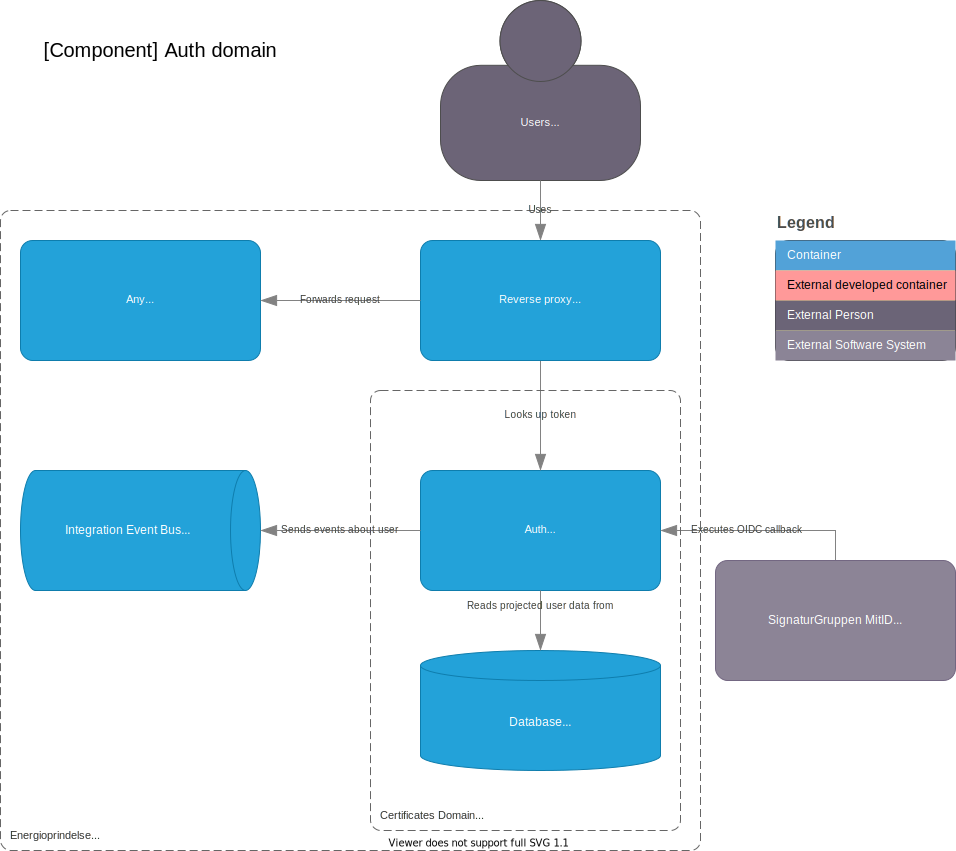

# Auth Domain

## Container diagram

## Component

There is description of the endpoints available at [Auth API](../../api/auth.md).

### Tokens

Inner vs Outer tokens.

Claims on each

### Diagram

The component diagram shows a first iteration which is based on an in-memory integration event bus. A consequence of using the in-memory implementation is that all components that is dependent on the integration event bus must be in same container.

Components that is used for mocking and will be replaced or discarded at a later are marked with its own color in the diagram.

