# Authorization Domain

## Subsystem container diagram

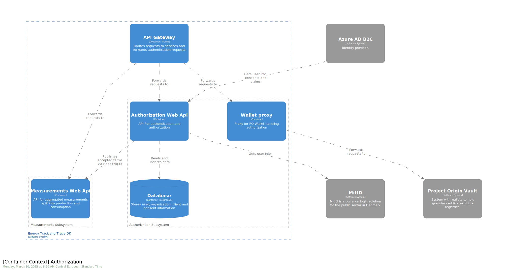

## Consent

This section describes the first version of consent functionality in Energy Origin. Consent is granted by one organization to another organization. More specifically, a user from an organization accepts a request for consent using the UI.

### Definitions

- 3rd party Service provider client: A 3rd party company using the APIs exposed by Energy Track & Trace (ETT). A 3rd party may have software systems running and interacting with the Energy Origin APIs without user interaction.
- User: A user authenticated with MitID erhverv and acting as employee in a company (organization). A user may be employed by multiple companies, but is forced to select a specific company as part of MitID authenticattion.
- TIN: Tax Identification Number, in Denmark the CVR number.
- Terms of service: Terms of service a user must agree to, before using Energy Origin Web application or APIs.
- Service provider terms: Terms a service provider must agree to before using the ETT APIs.
- Consent: Consent is granted from one organization (giver) to another oreganization (receiver). A user grants the consent using the UI. The organization receiving the consent may be a 3rd party service provider. After receiving consent, the receiving organization may use ETT APIs or UI on behalf of the consent giving organization.

### Conceptual overview

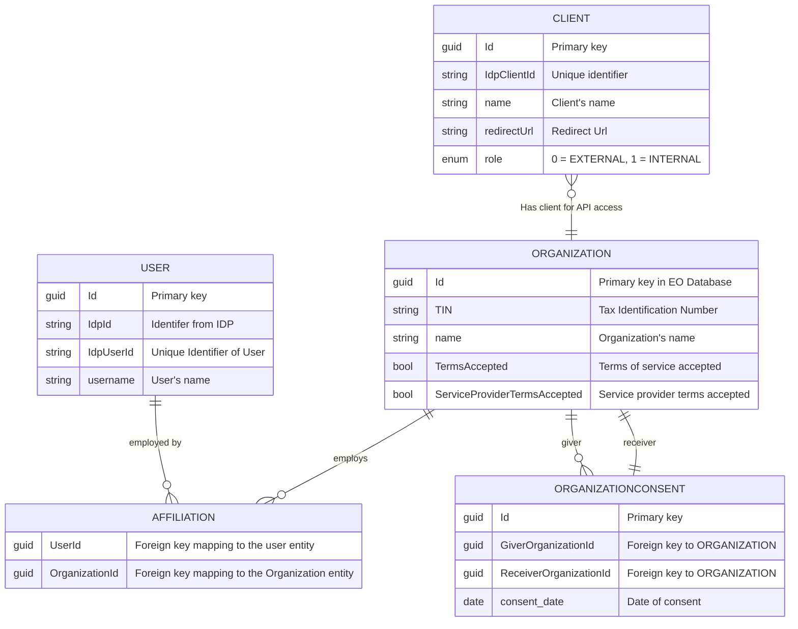

A user authenticating using MitID will work in the context of a single organization identified by a TIN. To work in the context of another organization, the user will need to authenticate again and select a different organization as part of the authentication process.

The ETT UI supports consent, the user may change the current organization to another one given the consent selector in the lower left corner.

A client will be authenticated to work in the context of its own organization. Imagine the client is running a software system trading certificates on behalf of all the organizations it has been granted consent to. In order to select which consent to use, the individual API request should contain the id of the organization to work on.

Our use of the Client Credentials flow is described by Microsoft in the following article [Client Credentials Grant](https://learn.microsoft.com/en-us/entra/identity-platform/v2-oauth2-client-creds-grant-flow).

## Organization whitelist


## API Specifications

- [Authorization API](https://demo.energytrackandtrace.dk/swagger/?urls.primaryName=Authorization+v1).
- [Authorization Proxy API](https://demo.energytrackandtrace.dk/swagger/?urls.primaryName=Wallet+v1).

## Use cases

### Sign-up

The first user from an organization who logs into the ETT web application, will have to accept the _terms of service_. Subsequent users from the same organization will not be required to accept terms again.

Users and organizations are persisted as part of terms acceptance and login. No user data is required to be setup before allowing a user to login.

To use the ETT APIs, service providers will have to accept _service provider terms_. Accepting these terms are part of the onboarding process.

### Accept terms of service

The Terms Acceptance feature allows organizations to accept the latest terms and conditions.
When an organization accepts the terms, the Authorization database is updated, and an integration event is published.

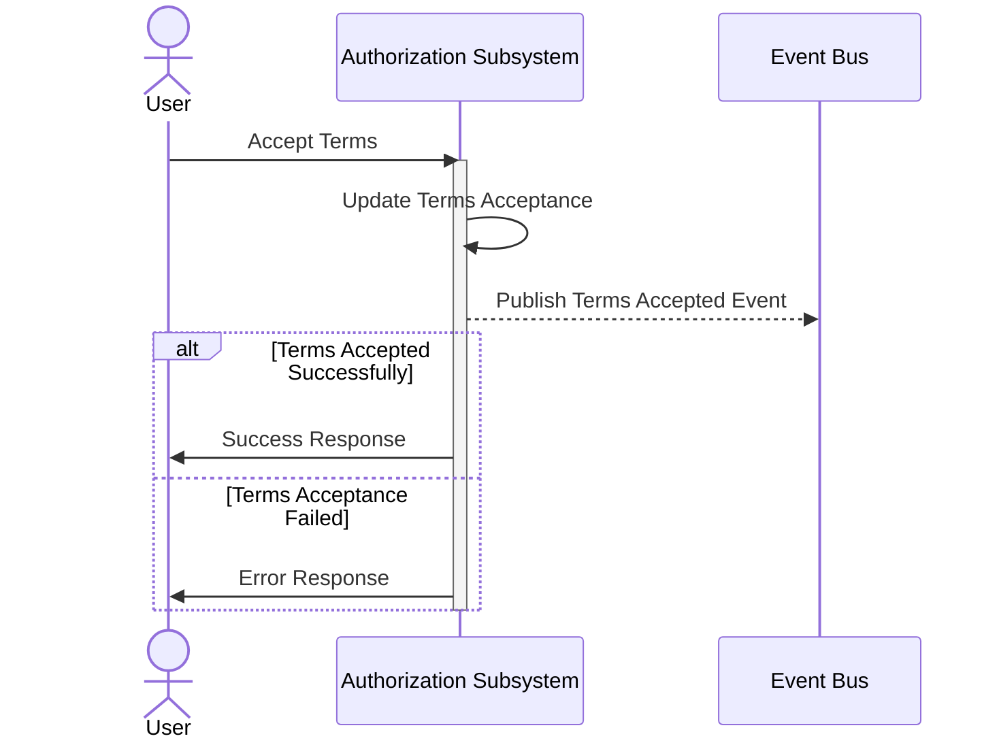

The endpoint requires authorization with the `B2CCvrClaim policy`. This policy ensures that the user attempting to accept the terms is indeed affiliated with the organization, they are accepting the terms on behalf of. The policy is implemented as a custom authorization policy, in the [EnergyOrigin.TokenValidation library](../../../domains/libraries/EnergyOrigin.TokenValidation/).

### Grant consent to service provider

Grant consent for 3rd party client to access and manage data in Energy Origin.

```mermaid
sequenceDiagram
    actor User
    participant ClientApp as Client Web Application
    participant EO as Energy Track & Trace
    participant B2C as B2C
    participant MitID as MitID
    participant Auth as Authorization

    User->>ClientApp: Grant consent
    ClientApp->>EO: Redirect to EO
    rect rgb(50, 50, 50)
        note over EO, MitID: Authorization Code Flow
        EO->>B2C: Redirect to B2C
        B2C->>MitID: Redirect to MitID
        User->>MitID: Login
        MitID->>B2C: Successful login (tokens)
        B2C->>EO: Successful login (tokens)
    end
    activate EO
    EO->>EO: Redirect user to consent page

    User->>EO: User accepts consent
    EO->>Auth: Update consent (link CVR and clientId)
    deactivate EO
```

### Service provider API access

Call Energy Origin API as 3rd party client on behalf of organization.

```mermaid
sequenceDiagram
    participant ClientApp as Client Backend
    participant B2C as B2C
    participant Auth as Authorization Subsystem
    participant Cert as Certification API

    rect rgb(50, 50, 50)
        note over ClientApp,Auth: Client Credentials Flow
        ClientApp->>B2C: Client Credentials flow
        activate B2C
        B2C->>B2C: Client credentials flow (B2C as client)
        B2C->>Auth: Get authorization (B2C access token)
        activate Auth
        Auth->>B2C: Authorization (claims)
        deactivate Auth
        B2C->>ClientApp: Token
        deactivate B2C
    end

    ClientApp->>Cert: API call (token)
    ClientApp->>Cert: ...
    ClientApp->>Cert: API call (token)
```

### Get Consent

The Consent Authorization API endpoints are used for fetching user/client authorization information. These endpoints are designed to be called from the custom policies running in Azure B2C. The custom policies are the only authorized callers of these endpoints.

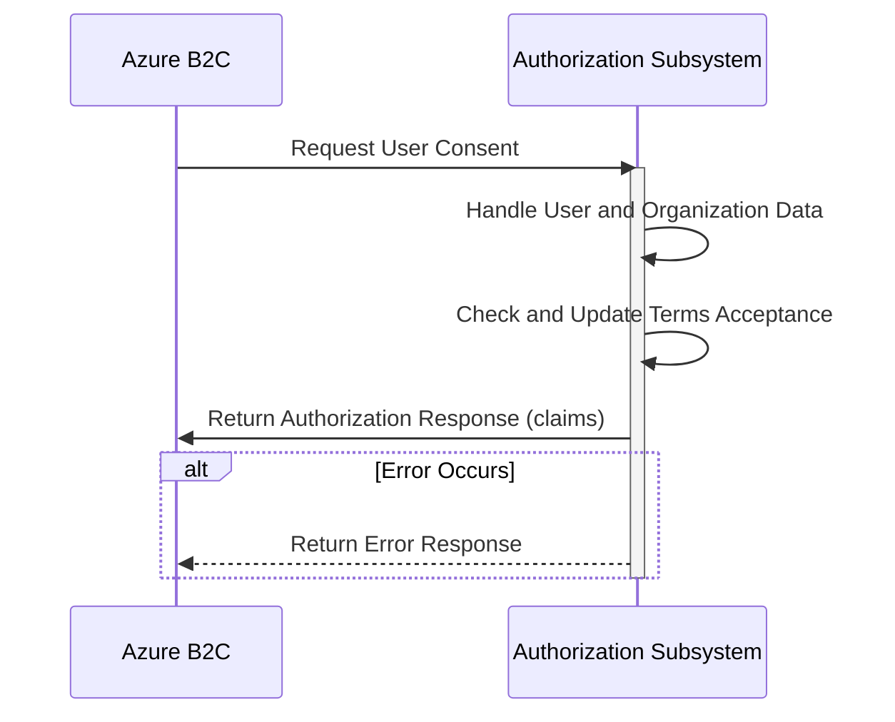

The endpoint for getting client authorization information is implemented in a similar fashion.

### Delete Consent

The User Delete Consent flow is responsible for enabling users to delete consents.

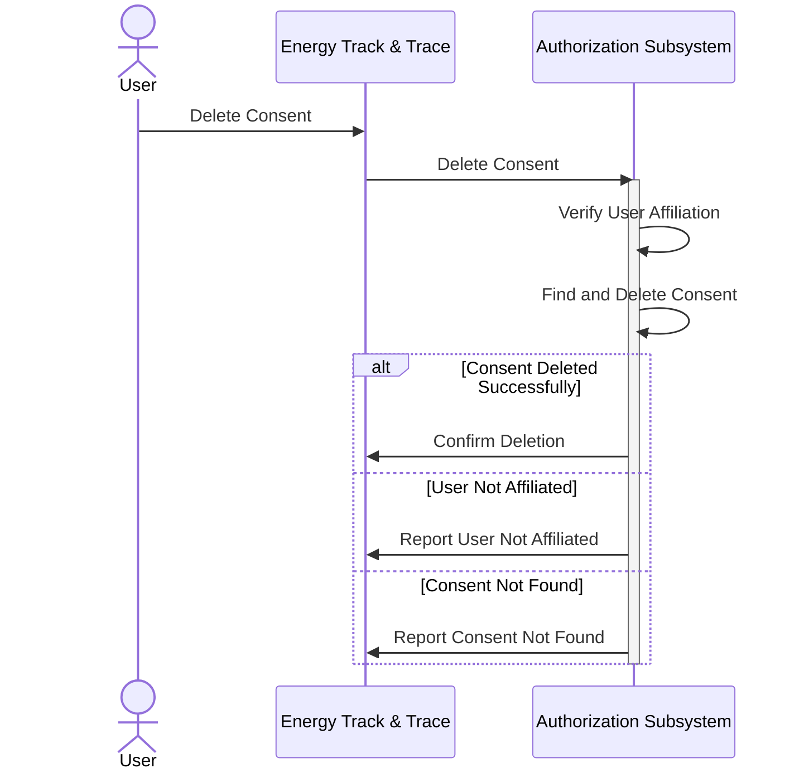

### Check if organization is whitelisted

The whitelist Authorization API endpoint is responsbile for checking whether an organization has been whitelisted to use ETT. The validation is done using the organizations 'Tin' (CVR).
This endpoint is designed to be called from the custom policies running in Azure B2C. The custom policies are the only authorized callers of this endpoint.

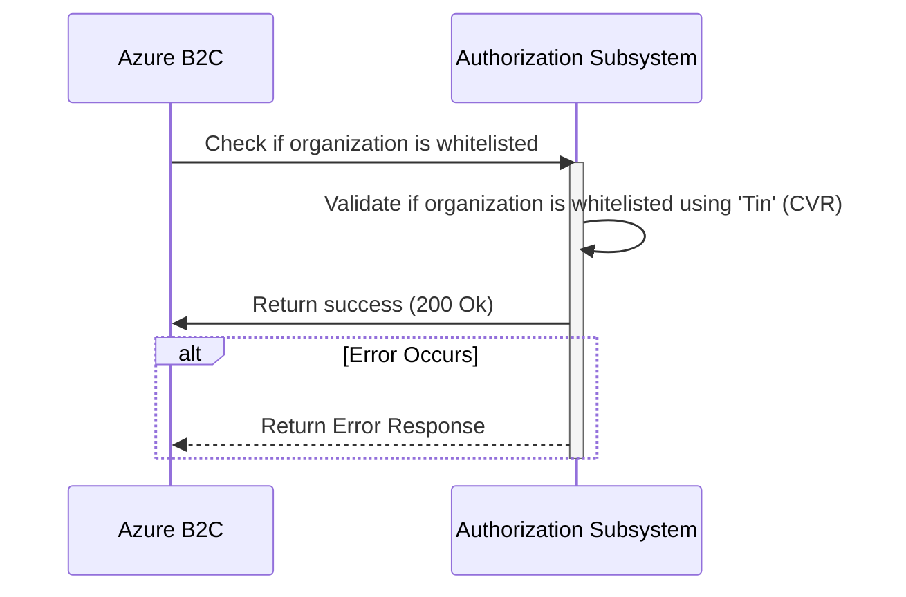

## Deployment

### Register B2C as client

Azure B2C itself will have to be registered as a client. This allows B2C to obtain a token for itself and call the ETT authorization API.

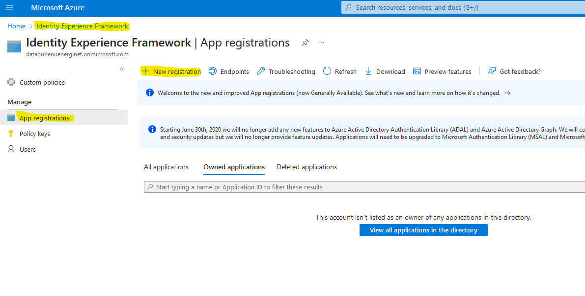

Provide the name `self` for the app, and register by clicking `Register`.

Afterwards change settings in the manifest file. Make sure the following two settings are present: `"signInAudience": "AzureADMyOrg"` and `"accessTokenAcceptedVersion": 2`.

Add a new client secret to the app registration.

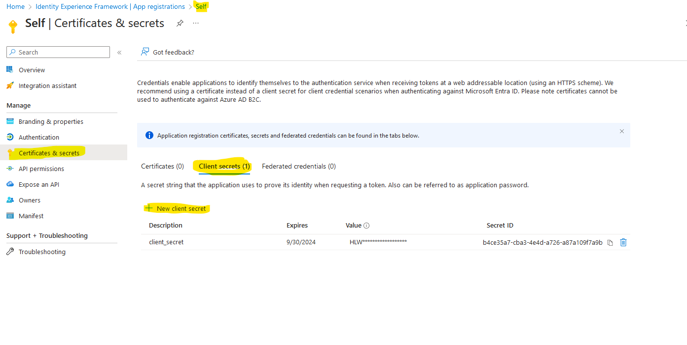

Make sure to copy the secret value and store it somewhere safe. Use client id and client secret to configure client_credentials custom policy.

## Links

[Signaturgruppen technical documentation](https://signaturgruppen-a-s.github.io/signaturgruppen-broker-documentation/)

[MitID test user tool](https://pp.mitid.dk/test-tool/frontend/#/view-identity)

[MitID admin tool](https://pp.netseidbroker.dk/admin#/clients/e9d55f7d-03b6-4ec8-be83-f2804f32f9d0) (User: energinet-test-admin and use mitid login, not erhverv)

[MitID test clients](https://signaturgruppen-a-s.github.io/signaturgruppen-broker-documentation/test-clients.html)

[Confluence: MitID test brugere](https://energinet.atlassian.net/wiki/spaces/ElOverblik/pages/678133811) (We currently use Sylvester68903ErhvervEO as test user)

[Confluence: Driftinfo hos Netsbroker](https://energinet.atlassian.net/wiki/spaces/ElOverblik/pages/307232769)

[EID](https://www.signicat.com/products/identity-proofing/eid-hub)

## Test with ngrok on localhost

In order to debug B2C custom policies, it may be helpful to see the what requests are being made. NGrok may be used to set up a public HTTP service, where all requets are forwarded to a local developer machine.

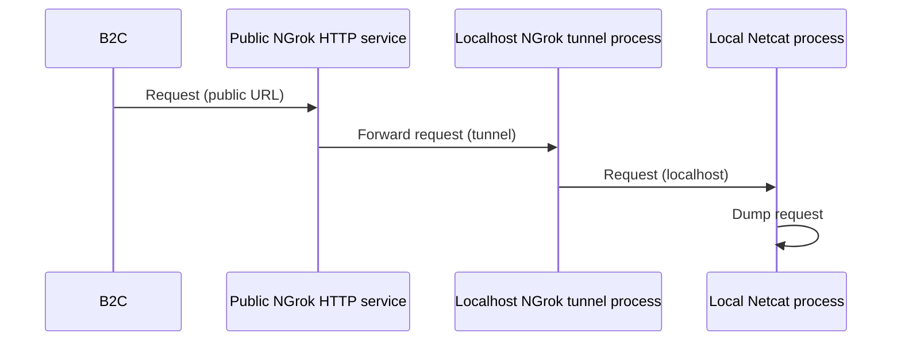

Set up ncat to listen and dump all traffic on port 9090 on localhost

```nc -k -l 9090```

Set up ngrok to forward traffic to netcat

```ngrok http 9090```

## Authorization Proxy

This section describes the first version of Authorization Proxy in Energy Origin. Authorization Proxy is built to handle authentication and authorization for opensource Wallet project. Since Wallet is opensource and needs to be generic, we have to have a wrapper (Authorization Proxy) to secure all calls against it. The way this is handled is by having 1 to 1 mapping between Wallet API's and the Authorization Proxy API. We then have extra requirements for providing OrganizationID, that we can check if client's request has access to, before forwarding the request towards Wallet API.

Authorization Proxy is made backwards compatible allowing old self signed tokens, aswell as the new Azure B2C tokens, to ensure we can use this new proxy service without breaking old code. The proxy is simple and only needs B2C, TokenValidation and WalletBaseUrl in enviroment variables.

The proxy disables the API endpoint for creating new wallets. The reason is that ETT assumes an organization has exactly one wallet, which is created as part of the onboarding process.
