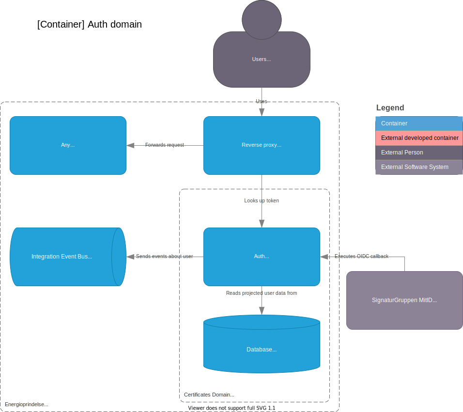
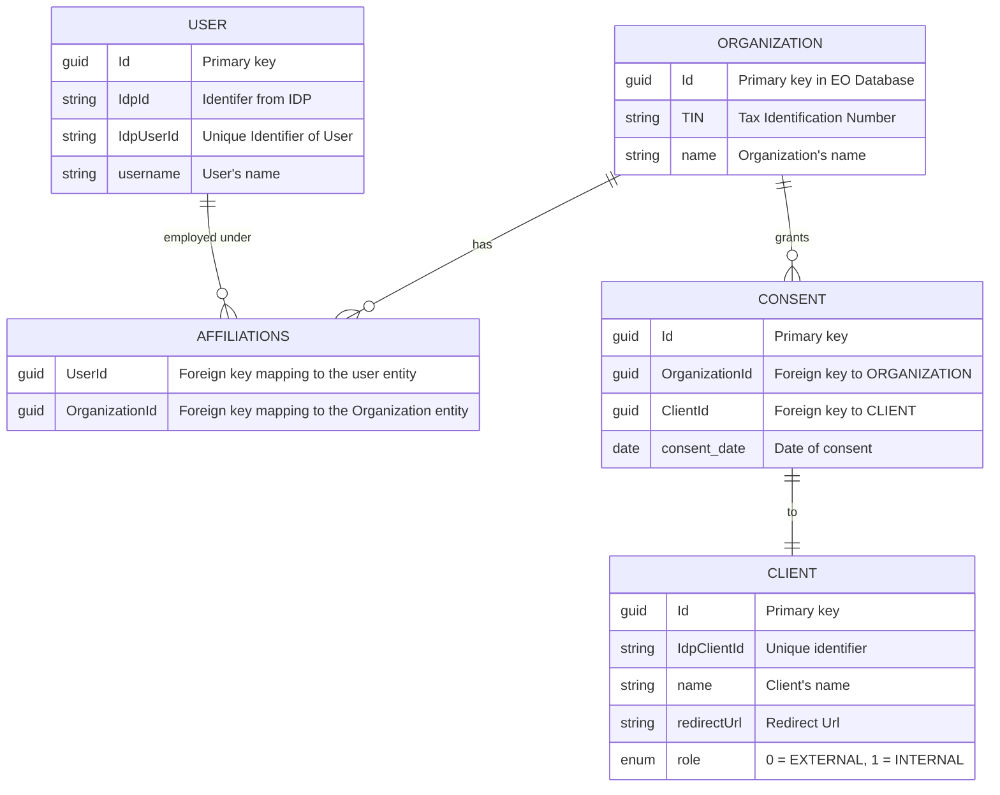
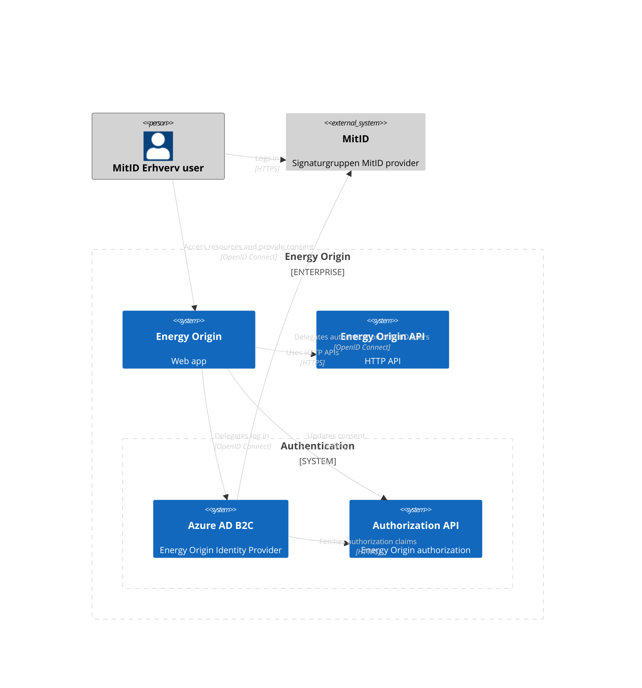
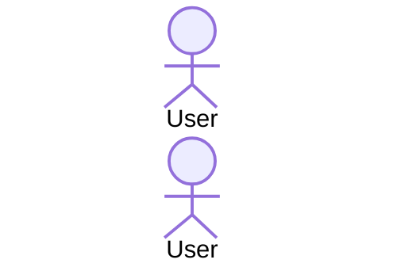

# Authorization Domain

## Container diagram



## Endpoints

There is a description of the current endpoints available at [Authorization API](https://demo.energytrackandtrace.dk/swagger/?urls.primaryName=Authorization%20Proxy%20v20230101).

There is a description of the current endpoints available at [Authorization Proxy API](https://demo.energytrackandtrace.dk/swagger/?urls.primaryName=Authorization%20v20230101#/).

# Authentication & authorization

## Consent

This section describes the first version of consent functionality in Energy Origin. Consent is provided by a user to a 3rd party client.

### Definitions

- 3rd party client: A third party company using the APIs exposed by Energy Origin. A 3rd party client may have software systems running and interacting with the Energy Origin APIs without user interaction.
- User: A user authenticated with MitID erhverv and acting as employee in a company. A user may be employeed in multiple companies, but is forced to select a specific company as part of MitID authenticattion.
- TIN: Tax Identification Number, in Denmark the CVR number.
- Terms: Terms a user must agree to, before using Energy Origin Web application or APIs.
- Consent: A user grants consent to a 3rd party. The 3rd party may after being granted consent, use Energy Origin APIs on behalf of the user.

### Conceptual overview



A user authenticating using MitID will work in the context of  asingle organization and TIN. To work in the context of another organization, the user will need to authenticate again and select a different organization.

A client will be authenticated to work in the context of all the organizations it has been granted consent to. Imagine the client is running a software system trading certificates on behalf of all the organizations it has been granted consent to.

Our use of the Client Credentials flow is described by Microsoft in the following article [Client Credentials Grant](https://learn.microsoft.com/en-us/entra/identity-platform/v2-oauth2-client-creds-grant-flow).

## System context



# Terms Acceptance API Documentation

## Overview

The Terms Acceptance API allows organizations to accept the latest terms and conditions. When an organization accepts the terms, the Authorization database is updated, and an integration event, is published, to RabbitMQ, using MassTransit's transactional outbox pattern.

## Endpoint

`POST /api/authorization/terms/accept
`
## Request

The endpoint expects an empty body. All necessary information is derived from the users' claims in their JWT token.

### Authorization

The endpoint requires authorization with the `B2CCvrClaim policy`.

This policy ensures that the user attempting to accept the terms, is indeed affiliated with the organization they are accepting the terms on behalf of.

The policy is implemented as a custom authorization policy in the [EnergyOrigin.TokenValidation NuGet package](../../../libraries/dotnet/EnergyOrigin.TokenValidation/README.md).

## Response

### Success (200 OK)

```json
{
  "status": true,
  "message": "Terms accepted successfully."
}
```

### Failure (400 Bad Request)
```json
{
  "status": false,
  "message": "Failed to accept terms."
}
```

### Failure (403 Forbidden)

```json
{}
```

## Implementation Details

### TermsController

The TermsController uses the IdentityDescriptor to extract information from the user's JWT token. It creates an AcceptTermsCommand from the following claims:

- **IdentityDescriptor.OrganizationCvr:** The organization's CVR number. Mapped from the **_org_cvr_** claim
- **IdentityDescriptor.OrganizationName:** The name of the organization. Mapped from the _**org_name**_ claim
- **IdentityDescriptor.Subject:** The user's unique identifier. Mapped from the **_sub_** claim

### AcceptTermsCommand

The AcceptTermsCommand is a record with the following properties:

```csharp
public record AcceptTermsCommand(
    string OrgCvr,  <--- Mapped from the IdentityDescriptor.OrganizationCvr
    string OrgName, <--- Mapped from the IdentityDescriptor.OrganizationName
    Guid UserId     <--- Mapped from the IdentityDescriptor.Subject
    );
```

### AcceptTermsCommandHandler

The AcceptTermsCommandHandler processes the AcceptTermsCommand and performs the following steps:

1. Begins a database transaction.
2. Retrieves or creates the organization based on the provided CVR.
3. Fetches the latest terms from the database.
4. Updates the organization's terms acceptance status if necessary.
5. Commits the database transaction.
6. Publishes an integration event using the [EnergyOrigin.IntegrationEvents package](../../../libraries/dotnet/EnergyOrigin.IntegrationEvents/README.md).

## Terms Management

### Terms Storage

The system supports multiple versions of terms and conditions. Terms are stored in the database using the Terms entity, which includes an Id and a Version.

### Organization Terms Acceptance

The Organization entity tracks the terms acceptance status for each organization, including whether terms are accepted, the version of accepted terms, and the acceptance date.

### Latest Terms Version Requirement

The current implementation requires organizations to accept the latest version of the terms. This is enforced in the AcceptTermsCommandHandler by fetching the latest terms and updating the organization's acceptance status if necessary.

### Invalidating Terms

The Organization entity includes an InvalidateTerms() method, which can be used to mark the current terms as no longer accepted.

## Error Handling

If an error occurs during the terms acceptance process:
1. The database transaction is rolled back.
2. No integration event is published.
3. The API returns a 400 Bad Request response.

## Future Considerations

While the current implementation requires acceptance of the latest terms, the data model supports more complex scenarios that could be implemented in the future, such as:

1. Allowing organizations to accept specific versions of terms.
2. Implementing a grace period for accepting new terms versions.
3. Tracking a history of terms acceptances for each organization.
4. Implementing different sets of terms for different purposes or user roles.


## Sign-up flow & Terms

Fist time a MitID user logs into the Energy Origin Web application, the user will have to go through some steps. After agreeing to terms and conditions, a 'shadow' user will be creater in B2C.



## Grant consent to 3rd party

Grant consent for 3rd party client to access and manage data in Energy Origin.

```mermaid
sequenceDiagram
    actor User
    participant ClientApp as Client Application
    participant EO as Energy Origin
    participant B2C as B2C
    participant MitID as MitID
    participant Auth as Authorization

    User->>ClientApp: Grant consent
    ClientApp->>EO: Redirect to EO

    rect rgb(50, 50, 50)
        note over EO, MitID: Authorization Code Flow
        EO->>B2C: Redirect to B2C
        B2C->>MitID: Redirect to MitID
        User->>MitID: Login
        MitID->>B2C: Successfull login (tokens)
        B2C->>EO: Successfull login (tokens)
    end

    activate EO
    EO->>EO: Redirect user to consent page

    User->>EO: User accepts consent
    EO->>Auth: Update consent (link CVR and clientId)
    deactivate EO
```



## 3rd party access

Call Energy Origin API as 3rd party client on behalf of organization.

```mermaid
sequenceDiagram
    participant ClientApp as Client Backend
    participant B2C as B2C
    participant Auth as Authorization
    participant Cert as Certification API

    rect rgb(50, 50, 50)
        note over ClientApp,Auth: Client Credentials Flow
        ClientApp->>B2C: Client Credentials flow
        activate B2C
        B2C->>B2C: Client credentials flow (B2C as client)
        B2C->>Auth: Get authorization (B2C access token)
        activate Auth
        Auth->>B2C: Authorization (CVR list)
        deactivate Auth
        B2C->>ClientApp: Token
        deactivate B2C
    end

    ClientApp->>Cert: API call (token)
    ClientApp->>Cert: ...
    ClientApp->>Cert: API call (token)
```



## Deployment

### Register B2C as client

Azure B2C itself will have to be registered as a client. This allows B2C to obtain a token for itself and call the EO authorization API.


Provide the name `self` for the app, and register by clicking `Register`.

Afterwards change settings in the manifest file. Make sure the following two settings are present: `"signInAudience": "AzureADMyOrg"` and `"accessTokenAcceptedVersion": 2`.

Add a new client secret to the app registration.


Make sure to copy the secret value and store it somewhere safe. Use client id and client secret to configure client_credentials custom policy.

## Links

[MitID test user tool](https://pp.mitid.dk/test-tool/frontend/#/view-identity)

[MitID admin tool](https://pp.netseidbroker.dk/admin#/clients/e9d55f7d-03b6-4ec8-be83-f2804f32f9d0)

[MitID test clients](https://broker.signaturgruppen.dk/en/technical-documentation/open-oidc-clients)


[Confluence: MitID test brugere](https://energinet.atlassian.net/wiki/spaces/ElOverblik/pages/678133811)

[Confluence: Driftinfo hos Netsbroker](https://energinet.atlassian.net/wiki/spaces/ElOverblik/pages/307232769)

[EID](https://www.signicat.com/products/identity-proofing/eid-hub)

## Test with ngrok on localhost

Set up ncat to listen and dump all traffic on port 9090 on localhost

```nc -k -l 9090```

Set up ngrok to forward traffic to netcat

```ngrok http 9090```

# Authorization Proxy

This section describes the first version of Authorization Proxy in Energy Origin. Authorization Proxy is built to handle authentication and authorization for opensource Wallet project. Since Wallet is opensource and needs to be generic, we have to have a wrapper (Authorization Proxy) to secure all calls against it. The way this is handled is by having 1 to 1 mapping between Wallet API's and the Authorization Proxy API. We then have extra requirements for providing OrganizationID, that we can check if client's request has access to, before forwarding the request towards Wallet API.

Authorization Proxy is made backwards compaitble allowing old self signed tokens, aswell as the new Azure B2C tokens, to ensure we can use this new proxy service without breaking old code. The proxy is simple and only needs B2C, TokenValidation and WalletBaseUrl in enviroment variables.

# TODO:
We need to align on what documentation to keep, delete dead documents and update authorization documentation.
https://app.zenhub.com/workspaces/team-atlas-633199659e255a37cd1d144f/issues/gh/energinet-datahub/energy-origin-issues/2909
