# Terms Acceptance Documentation

## Overview

The Terms Acceptance API allows organizations to accept the latest terms and conditions.
When an organization accepts the terms, the Authorization database is updated, and an integration event is published
to RabbitMQ, using MassTransit's transactional outbox pattern.

## Accept terms flow:

```mermaid
sequenceDiagram
    actor User
    participant API as Terms Endpoint
    participant Handler as Command Handler
    participant DB as Database
    participant RabbitMQ as RabbitMQ Broker

    User->>API: POST /api/authorization/terms/accept
    activate API
    API->>API: Validate JWT and extract claims
    API->>Handler: Send AcceptTermsCommand
    activate Handler

    rect rgb(50, 50, 50)
        Note over Handler, DB: Database Interactions
        Handler->>DB: Begin transaction
        activate DB
        Handler->>DB: Get or create organization
        DB-->>Handler: Return organization
        Handler->>DB: Fetch latest terms
        DB-->>Handler: Return latest terms
        Handler->>DB: Update organization's terms acceptance
        DB-->>Handler: Confirm update
        Handler->>DB: Commit transaction
        DB-->>Handler: Confirm commit
        deactivate DB
    end

    rect rgb(50, 50, 50)
        note over Handler, RabbitMQ: Publish integration event
        Handler->>RabbitMQ: Send OrgAcceptedTerms message
    end

    Handler-->>API: Return true
    deactivate Handler

    API-->>User: 200 OK (Terms accepted successfully)
    deactivate API

    alt Terms Acceptance Fails
        activate Handler
        Handler-->>API: Return false
        deactivate Handler
        activate API
        API-->>User: 400 Bad Request (Failed to accept terms)
        deactivate API
    end
```



## Endpoint

`
POST /api/authorization/terms/accept
`
## Request

The endpoint expects an empty body. All necessary information is derived from the users' claims in their JWT token.

### Authorization

The endpoint requires authorization with the `B2CCvrClaim policy`.

This policy ensures that the user attempting to accept the terms is indeed affiliated with the organization,
they are accepting the terms on behalf of.

The policy is implemented as a custom authorization policy,
in the [EnergyOrigin.TokenValidation NuGet package](../../../../../libraries/dotnet/EnergyOrigin.TokenValidation/README.md).

## Response

### Success (200 OK)

```json
{
  "status": true,
  "message": "Terms accepted successfully."
}
```

### Failure (400 Bad Request)
```json
{
  "status": false,
  "message": "Failed to accept terms."
}
```

### Failure (403 Forbidden)

```json
{}
```

## Implementation Details

### TermsController

The TermsController uses the IdentityDescriptor to extract information from the user's JWT token. It creates an AcceptTermsCommand from the following claims:

- **IdentityDescriptor.OrganizationCvr:** The organization's CVR number. Mapped from the **_org_cvr_** claim
- **IdentityDescriptor.OrganizationName:** The name of the organization. Mapped from the _**org_name**_ claim
- **IdentityDescriptor.Subject:** The user's unique identifier. Mapped from the **_sub_** claim

### AcceptTermsCommand

The AcceptTermsCommand is a record with the following properties:

```csharp
public record AcceptTermsCommand(
    string OrgCvr,  <--- Mapped from the IdentityDescriptor.OrganizationCvr
    string OrgName, <--- Mapped from the IdentityDescriptor.OrganizationName
    Guid UserId     <--- Mapped from the IdentityDescriptor.Subject
    );
```

### AcceptTermsCommandHandler

The [AcceptTermsCommandHandler](../../../../../domains/authorization/Authorization.API/API/Authorization/[Features]/AcceptTermsCommand.cs) processes the AcceptTermsCommand and performs the following steps:

1. Begins a database transaction.
2. Retrieves or creates the organization based on the provided CVR.
3. Fetches the latest terms from the database.
4. Updates the organization's terms acceptance status if necessary.
5. Commits the database transaction.
6. Publishes an integration event record, defined in [EnergyOrigin.IntegrationEvents package](../../../../../libraries/dotnet/EnergyOrigin.IntegrationEvents/README.md).

### Integration Event

Upon successful terms acceptance, the system publishes an OrgAcceptedTerms event with the following information:

- A unique event ID
- A trace ID for distributed tracing
- The timestamp of the event
- The organization's database ID
- The organization's CVR number
- The ID of the user who accepted the terms

```csharp
await _publishEndpoint.Publish(new OrgAcceptedTerms(
    Guid.NewGuid(),
    Activity.Current?.Id ?? Guid.NewGuid().ToString(),
    DateTimeOffset.UtcNow,
    usersAffiliatedOrganization.Id,
    request.OrgCvr,
    request.UserId
), cancellationToken);
```

***Note:** The OrgAcceptedTerms Integration event record is described [here](../../../../../libraries/dotnet/EnergyOrigin.IntegrationEvents/doc/specific-events/authorization-acceptance-of-terms.md):

### Transactional Outbox Pattern

The system uses MassTransit's transactional outbox pattern to ensure reliable message publishing. This pattern works as follows:

1. The OrgAcceptedTerms event is stored in an outbox table in the same database transaction as the terms acceptance update.
2. If the database transaction is successful, the event is guaranteed to be in the outbox table.
3. A background process periodically checks the outbox table for unpublished messages.
4. When an unpublished message is found, it is published to the RabbitMQ message broker.
5. After successful publishing, the message is marked as published in the outbox table.

## Terms Management

### Terms Storage

The domain supports multiple versions of terms and conditions. Terms are stored in the database in the terms table, with an `Id` and a `Version`:

**Terms Entity Model:**
```csharp
public class Terms : IEntity<Guid>
{
    public Guid Id { get; private set; }
    public string Version { get; private set; } = null!;
}
```

### Organization Terms Acceptance

The Organization entity tracks the terms acceptance status for each organization, including whether terms are accepted, the version of accepted terms, and the acceptance date:

```csharp
public bool TermsAccepted { get; private set; }
public string? TermsVersion { get; private set; }
public DateTimeOffset? TermsAcceptanceDate { get; private set; }
```


***NOTE:**
It has been decided that the domain, and persistence layer should enforce acceptance of the terms,
before Organization records are inserted into the database.
The `TermsAccepted` field is therefore marked as `NON-NULLABLE`

***NOTE:**
In order to not break existing organization records in the database,
who have been created prior to the introduction of the terms feature,
the migration will set the `TermsAccepted` field to `false`, by default, through the migration:

**ApplicationDbContext**:

```csharp
private static void ConfigureOrganizationTable(ModelBuilder modelBuilder)
{

    modelBuilder.Entity<Organization>().Property(o => o.TermsAccepted)
        .IsRequired()
        .HasDefaultValue(false); // <---- Adding this to not break existing Organization records

    modelBuilder.Entity<Organization>().Property(o => o.TermsVersion);

    modelBuilder.Entity<Organization>().Property(o => o.TermsAcceptanceDate);
}
```
**AddTerms migration file:**

```csharp
migrationBuilder.AddColumn<bool>(
    name: "TermsAccepted",
    table: "Organizations",
    type: "boolean",
    nullable: false,
    defaultValue: false // <---- Set defaultValue = false, so we don't break existing records
    );
```

### Latest Terms Version Requirement

The current implementation requires organizations to accept the latest version of the terms.
This is enforced in the `AcceptTermsCommandHandler` by fetching the latest terms,
and updating the organization's acceptance status if necessary:

```csharp
var latestTerms = await _termsRepository.Query()
    .OrderByDescending(t => t.Version)
    .FirstOrDefaultAsync(cancellationToken);

if (latestTerms == null)
{
    return false;
}

if (!usersAffiliatedOrganization.TermsAccepted || usersAffiliatedOrganization.TermsVersion != latestTerms.Version)
{
    usersAffiliatedOrganization.AcceptTerms(latestTerms);
}
```

### Invalidating Terms

The `Organization` entity model includes an InvalidateTerms() method,
which can be used to mark the current terms as no longer accepted.

```csharp
public void InvalidateTerms() => TermsAccepted = false;
```

## Error Handling

If an error occurs during the terms acceptance process then:
1. The database transaction is rolled back.
2. No integration event is published.
3. The API returns a `400 Bad Request` response.

## Future Considerations

While the current implementation requires acceptance of the latest terms,
the data model supports more complex scenarios that could be implemented in the future, such as:

1. Allowing organizations to accept specific versions of terms.
2. Implementing a grace period for accepting new terms versions.
3. Tracking a history of terms acceptances for each organization (For auditing purposes)
4. Implementing different sets of terms for different purposes or user roles.
