# User Consent Authorization Documentation

## Overview

The User Consent Authorization API is responsible for retrieving and managing user authorization models.
This endpoint is designed to work in tandem with the Azure B2C tenant,
which is the only authorized caller of this endpoint.
The primary purpose is to validate user consent, check terms acceptance,
and manage user and organization relationships in the system.

## User Consent Flow

```mermaid
sequenceDiagram
    participant B2C as Azure B2C
    participant API as Authorization API
    participant Handler as Command Handler
    participant DB as Database

    activate B2C
    B2C->>API: POST /api/authorization/user-consent/
    Note over B2C,API: Send user info (sub, name, orgName, orgCvr)
    activate API

    API->>Handler: Create and send GetConsentForUserCommand
    Note over API,Handler: Command contains sub, name, orgName, orgCvr
    activate Handler

    rect rgb(50, 50, 50)
        Note over Handler, DB: Database Interactions
        Handler->>DB: Begin Transaction
        activate DB

        Handler->>DB: Query Organization by CVR
        DB-->>Handler: Return Organization (if exists)

        alt Organization doesn't exist
            Handler->>DB: Create new Organization
            DB-->>Handler: Return new Organization
        end

        Handler->>DB: Query Latest Terms
        DB-->>Handler: Return Latest Terms

        Handler->>DB: Query User by Sub
        DB-->>Handler: Return User (if exists)

        alt User doesn't exist
            Handler->>DB: Create new User
            DB-->>Handler: Return new User
        end

        Handler->>DB: Check/Update User-Organization Affiliation
        DB-->>Handler: Confirm Affiliation

        alt Terms not accepted or outdated
            Handler->>DB: Update Terms Acceptance Status
            DB-->>Handler: Confirm Update
        end

        Handler->>DB: Commit Transaction
        DB-->>Handler: Confirm Commit
        deactivate DB
    end

    Handler-->>API: Return GetConsentForUserCommandResult
    deactivate Handler

    API-->>B2C: Return UserAuthorizationResponse
    Note over API,B2C: Response mapped from CommandResult
    deactivate API
    deactivate B2C

    alt Error occurs during process
        activate Handler
        activate DB
        Handler->>DB: Rollback Transaction
        DB-->>Handler: Confirm Rollback
        deactivate DB
        Handler-->>API: Throw Exception
        deactivate Handler
        activate API
        API-->>B2C: Return Error Response
        deactivate API
    end

```



## Endpoint

```http request
POST /api/authorization/user-consent/
```

## Purpose

The endpoint serves several functions:

1. Validates user and organization information.
2. Checks for [terms acceptance](./accept-terms.md).
3. Creates or updates user and organization records.
4. Manages user-organization affiliations.
5. Provides authorization information for the user.

### Azure B2C Integration

This endpoint is designed to be called exclusively by the Azure B2C tenant as part of the authentication flow.
The B2C tenant sends user information obtained during the sign-in process,
and this endpoint responds with the necessary authorization details.

## Request

The endpoint expects a JSON body with the following structure:

```json
{
  "sub": "user-unique-identifier",
  "name": "Users Full Name",
  "orgName": "Organizations Name",
  "orgCvr": "Organizations CVR Number"
}
```
## Response

### Success (200 OK)

```json
{
  "sub": "user-unique-identifier",
  "subType": "User",
  "orgName": "Organization Name",
  "orgIds": ["organization-guid"],
  "scope": "dashboard production meters certificates wallet",
  "termsAccepted": true
}
```

## Implementation Details

### GetConsentForUserCommand

The `GetConsentForUserCommand` is created from the request body and contains:

- `Sub`: The user's unique identifier
- `Name`: The user's full name
- `OrgName`: The organization name
- `OrgCvr`: The organization's CVR number

### GetConsentForUserQueryHandler

The handler processes the command and performs the following steps:

1. Begins a database transaction
2. Retrieves or creates the organization based on the provided CVR
3. Checks for the latest terms and their acceptance status
4. Retrieves or creates the user record
5. Manages the user-organization affiliation
6. Commits the database transaction
7. Returns the authorization result

## Possible Scenarios

1. **New User and New Organization**
    - Creates new records for both user and organization
    - Terms are not accepted yet
    - Returns authorization with `termsAccepted: false`


2. **Existing User, New Organization**
    - Creates a new organization record
    - Associates the existing user with the new organization
    - Terms are not accepted yet
    - Returns authorization with `termsAccepted: false`


3. **New User, Existing Organization**
    - Creates a new user record
    - Associates the new user with the existing organization
    - If terms are accepted, returns `termsAccepted: true`, otherwise `false`


4. **Existing User and Organization**
    - Verifies the association between user and organization
    - Checks terms acceptance status
    - Returns authorization with appropriate `termsAccepted` value


5. **Terms Not Accepted**
    - In any scenario where terms are not accepted or are outdated
    - Returns authorization with `termsAccepted: false`
    - Limits the `orgIds` list to ensure proper access control


6. **Error Scenario**
    - If any error occurs during processing
    - Rolls back the database transaction
    - Throws an exception, which should be caught and handled by the controller

## Error Handling

If an error occurs during the process:

1. The database transaction is rolled back
2. An exception is thrown
3. The controller should catch this exception and return an appropriate error response

## Future Considerations

1. Implement more granular scopes for fine-tuned access control
2. Add support for different user types (e.g., admin, regular user)
3. Implement audit logging for all authorization checks and changes

