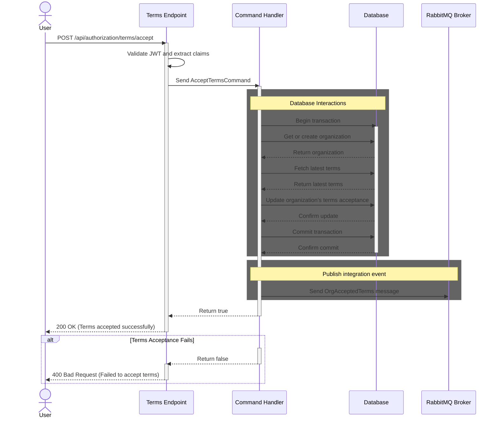

# Terms Acceptance Documentation

## Overview

The Terms Acceptance feature allows organizations to accept the latest terms and conditions.
When an organization accepts the terms, the Authorization database is updated, and an integration event is published
to RabbitMQ, using MassTransit's transactional outbox pattern.

## Accept terms flow:

## Endpoint

`
POST /api/authorization/terms/accept
`

### Authorization

The endpoint requires authorization with the `B2CCvrClaim policy`.

This policy ensures that the user attempting to accept the terms is indeed affiliated with the organization,
they are accepting the terms on behalf of.

The policy is implemented as a custom authorization policy,
in the [EnergyOrigin.TokenValidation NuGet package](../../../../../libraries/dotnet/EnergyOrigin.TokenValidation/README.md).
