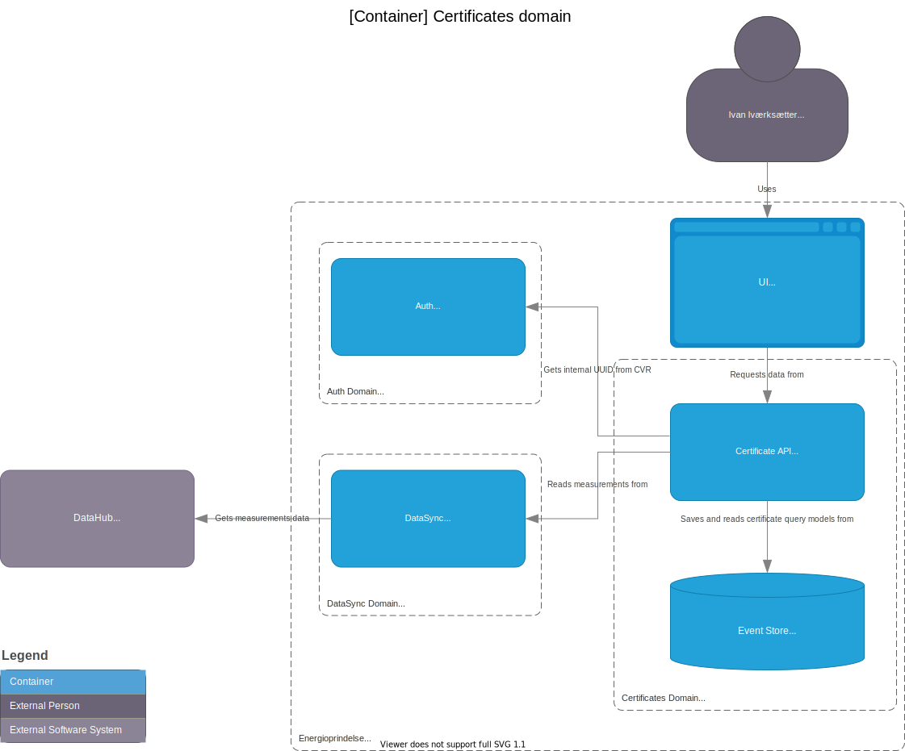
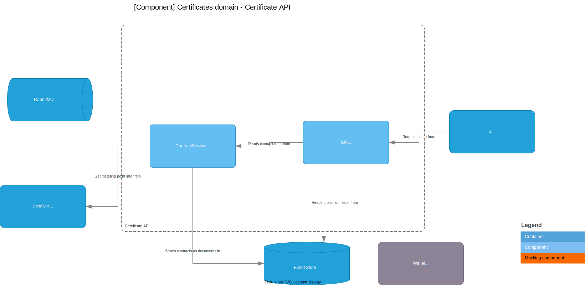
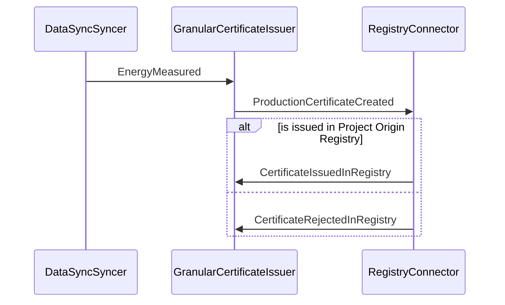

# Certificates Domain

The diagrams below are divided into:

* [Current architecture:](#current-architecture) Diagrams for what Team Atlas are building in the current or up-coming sprint
* [Target architecture:](#target-architecture) Diagrams for the desired target

The reason for this split is certain constraints. The constraints are:

* Integration Event Bus does not exist and the inter-domain events are not defined

## Current architecture (as-is)

### Container diagram

## Component diagram: Certificate API

The component diagram shows how the solution works, based on a RabbitMQ message broker that publishes the events received from the DataSyncSyncer.

Note: `ContractService` is currently getting information about a metering point from `DataSync`. In the future it is expected to get this from the MeteringPoints domain, but this domain does not exist at this point.

### Message flow: Issue certificate
The sequence diagram below shows the flow of messages between the components when issuing a certificate. All messages are published to the message broker; the message broker is not shown in the diagram.

## Target architecture (to-be)

### Container diagram

