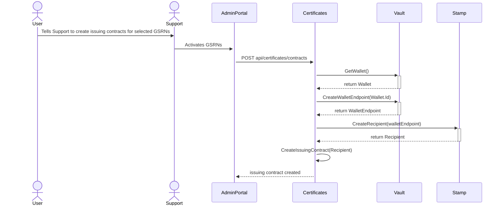

# Certificates Domain

## Current architecture

### Container diagram

https://structurizr.acorn-prod.dk/workspace/1/diagrams#CertificateContainers

### Component diagram: Certificate API

https://structurizr.acorn-prod.dk/workspace/1/diagrams#CertificateApiComponents

### Create issuing contract
The diagram below shows how issuing flow starts. It assumes a wallet has been created, which happens when the user accepts terms.

First the user calls support to activate selected GSRNs for issuing. Support activiates the GSRNs through the admin portal, which calls certificates api.
Stamp is our issuance system, which makes sure the certificate gets issued in the Registry and then sent to the correct wallet. In order for Stamp to know who receives the certificates being issued, a recipient must be present in Stamp. This is created when creating a issuing contract, and the id of the recipient is saved on the issuing contract. A recipient is a wallet endpoint of the receiving wallet, saved in stamp and marked with an id for identification.

After the issuing contract has been created, the Measurements Syncer starts sending measurements to Stamp. It does to by pulling measurements from DataHub 3.0 for each issuing contract and sending the measurements to Stamp, every hour. Read more about how Stamp issues certificates [here](https://github.com/project-origin/stamp/blob/main/doc/flows/issuance.md).
