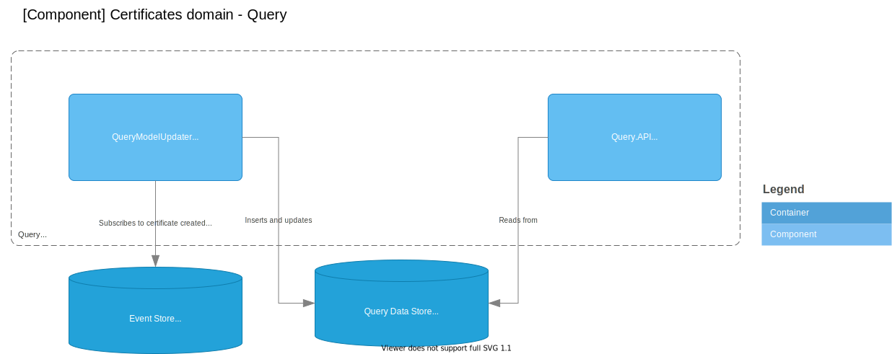

# Certificates Domain

The diagrams below are divided into:

* Current architecture: Diagrams for what Team Atlas are building in the current or up-coming sprint
* Target architecture: Diagrams for the desired target

The reason for this split is certain constraints. The constraints are:

* The Event Store is currently only available as an in-memory implmentation
* Registry is under development

## Current architecture

### Container diagram

## Component diagram: Issuer

The component diagram shows a first iteration which is based on an in-memory implementation of EventStore. A consequence of using the in-memory implementation is that all components that is dependent the EventStore must be in same container.

Components that is used for mocking and will be replaced or discarded at a later are marked with its own color in the diagram.

## Target architecture

### Container diagram

## Component diagram: Query

