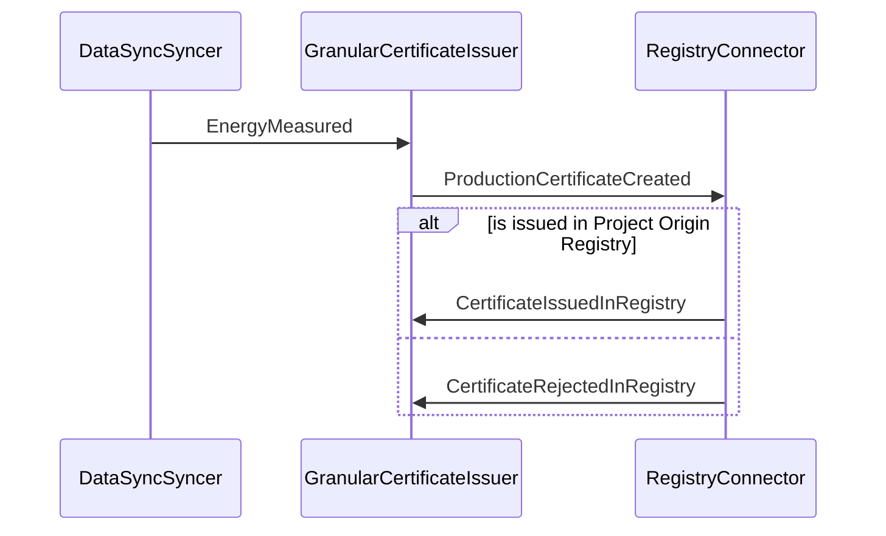

# Certificates Domain

The diagrams below are divided into:

* [Current architecture:](#current-architecture) Diagrams for what Team Atlas are building in the current or up-coming sprint
* [Target architecture:](#target-architecture) Diagrams for the desired target

The reason for this split is certain constraints. The constraints are:

* Integration Event Bus does not exist and the inter-domain events are not defined

## Current architecture (as-is)

### Container diagram

## Component diagram: Certificate API

The component diagram shows how the solution works, based on a RabbitMQ message broker that publishes the events received from the DataSyncSyncer.

Note: `ContractService` is currently getting information about a metering point from `DataSync`. In the future it is expected to get this from the MeteringPoints domain, but this domain does not exist at this point.

### Message flow: Issue certificate
The sequence diagram below shows the flow of messages between the components when issuing a certificate. All messages are published to the message broker; the message broker is not shown in the diagram.

TODO: Update sequence diagram

### Key position when sending slices to the wallet

A wallet deposit endpoint is needed in order to send slices to the wallet. A position for deriving the child key is needed for each slice sent to the wallet. The position is a integer in the Wallet API. It is a requirement that a new position is used for each new slice.

It is desirable to have a stateless way for getting the position. This is done by utilizing that a Contract is created for a single metering point and that we have a Wallet Deposit Endpoint on the Contract. The period for each certificate will thus be unique per Contract. So the start date of the period is used as input for calculating the position.

The position calculation algorithm must convert a date into an integer. This is done by calculating the number of minutes elapsed since Jan 1st 2022 (UTC).

_Why calculate since Jan 1st 2022?_ We need a start date, which is before any certificates will be issued. We also want it to be fairly close to when the first certificates will be issued as there is an upper limit for the key position based on this approach.

_What is the upper limit?_ The maximum key position is 2,147,483,647, which is the maximum value of at 32-bit integer. With a resolution of 1 minute, this means that the upper limit is a little more than 4,082 years. Or stated the differently, with the start date defined as above the upper limit is 6105-01-24T02:07:00Z.

_Why 1 minute resolution and not market resolution for electrical measurements?_ The market resolution can change (at the time of writing, it is 1 hour and will soon change to 15 minutes). By setting it to 1 minute, the solution does not care about changes in the market resolution as long as they are full minutes. If the market resolution drops below 1 minute, then this approach does not work.

## Target architecture (to-be)

### Container diagram

