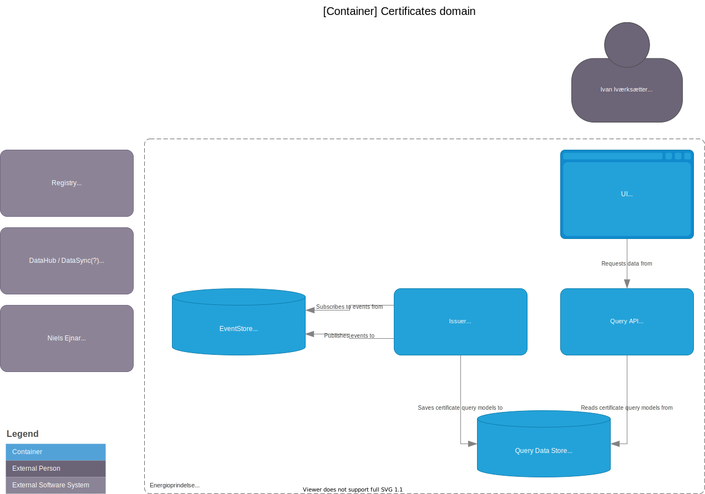

# Certificates Domain

## Container diagram

## Component diagram: Issuer

The component diagram shows a first iteration which is based on an in-memory implementation of EventStore. A consequence of using the in-memory implementation is that all components that is dependent the EventStore must be in same container. When switching to an implementation with persistant storage the Issuer container may be split into multiple containers.
