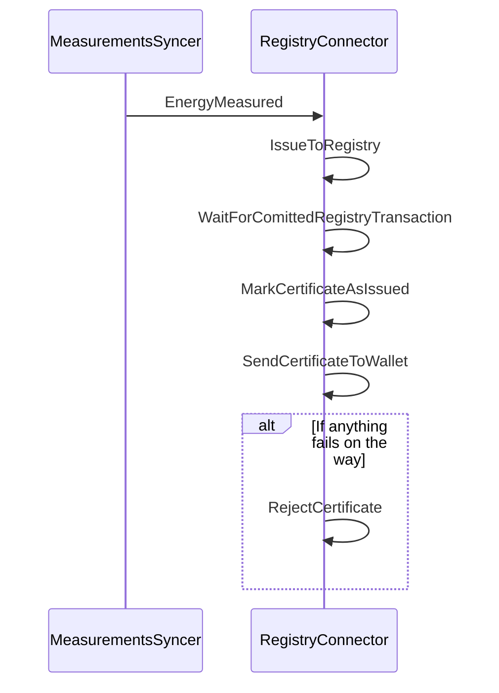

# Certificates Domain

## Current architecture (as-is)

### Container diagram

### Component diagram: Certificate API

The component diagram shows how the solution works, based on a RabbitMQ message broker that publishes the events received from the MeasurementsSyncer.

Note: `ContractService` is currently getting information about a metering point from `DataHubFacade`. In the future it is expected to get this from the MeteringPoints domain, but this domain does not exist at this point.

### Message flow: Issue certificate
The sequence diagram below shows the flow of messages between the components when issuing a single certificate. All messages are published to the message broker; the message broker is not shown in the diagram. Before that flow is possible, a wallet deposit endpoint must be created in the user's wallet; that happens as part of creating the Contract.

The RegistryConnector listens to EnergyMeasured events from the MeasurementsSyncer. The RegistryConnector is responsible for anything related to issuence. It utilizes MassTransit RoutingSlips in order to handle the issuence flow, which builds activities that are executed in sequence. If anything goes wrong in that sequnce, we have a subscription to handle it, which rejects the certificate.

The Registry only allows issuing of certificates from the issuing body and in this case that is Energinet. Hence, a Wallet System is not able to issue certificates. So the Certificates domain is responsible for issuing first to the registry and then sending to the wallet. For this to happen, the owner public key on the certificate must be created or calculated by the Certificates domain; the next section describes how the Certificates domain calculates the key.

### Key position when sending certificates/slices to the wallet

A wallet deposit endpoint is needed in order to send slices to the wallet. A position for deriving the child key is needed for each slice sent to the wallet. The position is a integer in the Wallet API. It is a requirement that a new position is used for each new slice.

It is desirable to have a stateless way for getting the position. This is done by utilizing that a Contract is created for a single metering point and that we have a Wallet Deposit Endpoint on the Contract. The period for each certificate will thus be unique per Contract. So the start date of the period is used as input for calculating the position.

The position calculation algorithm must convert a date into an integer. This is done by calculating the number of minutes elapsed since Jan 1st 2022 (UTC).

_Why calculate since Jan 1st 2022?_ We need a start date, which is before any certificates will be issued. We also want it to be fairly close to when the first certificates will be issued as there is an upper limit for the key position based on this approach.

_What is the upper limit?_ The maximum key position is 2,147,483,647, which is the maximum value of at 32-bit integer. With a resolution of 1 minute, this means that the upper limit is a little more than 4,082 years. Or stated the differently, with the start date defined as above the upper limit is 6105-01-24T02:07:00Z.

_Why 1 minute resolution and not market resolution for electrical measurements?_ The market resolution can change (at the time of writing, it is 1 hour and will soon change to 15 minutes). By setting it to 1 minute, the solution does not care about changes in the market resolution as long as they are full minutes. If the market resolution drops below 1 minute, then this approach does not work.
