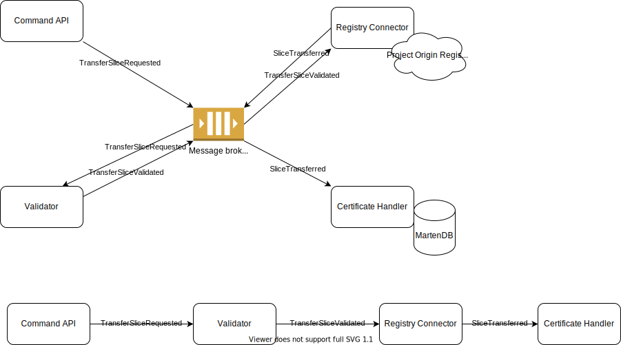

# Certificates Domain (New design)

## Working assumptions

The following lists the working assumptions. The design/architecture used needs to address the working assumptions; hence, the working assumptions are treated as facts. In the case a working assumption is wrong, it will be listed here stating the assumption and why it is incorrect

### Project Origin Registry

* Should be treated as an external system meaning that it may not be available
* Client library is designed to be used asynchronously
* Should not be used as a database for certificates
* It is not possible to query the registry, only commands (e.g. issue certificate, slice or transfer slice) can be sent to the registry
  * Observation point from XPTDU: We will most likely have "double bookkeeping" of the certificates on top of the Project Origin Registry. It is possible to we end up with misaligned certificates; e.g. a certificate in Project Origin Registry has 2 slices, but in EnergyOrigin it has 3 slices. In case a certificate gets misaligned, we need to do some compensating action. A way of doing that automatically could be to treat Project Origin Registry as the truth and then read the state or events for that certifacte from Project Origin Registry and then apply that to the certifate in Energy Origin. However, this compensating action is not possible if queries are not implemented by Project Origin Registry
* Commands is expected to take relatively long time. When a federated setup of registries is available, commands spanning multi registries will take even longer time (we are talking seconds here, not microseconds)
* Is not idempotent, so we should ensure that a command is not sent twice
  * Note from XPTDU: Not really sure about this. What will the registry do if the same command is sent multiple times?
* No locking mechanism for commands against a certificate exists. So if two commands are sent at the same time, only one is expected to win.
  * Observation point from XPTDU: If a certificate needs to be locked, then it must be done in Energy Origin (or by the Energy Origin API client)
  * It is not possible to do a distributed transaction

## Relationship between Project Origin Registry and data within certificates domain

* There will be double bookkeeping of certificates in our domain and Project Origin Registry
* Misalignment between the systems is possible and should be handled somehow
* For now, the approach taken is that Project Origin Registry is considered the truth. This mean that commands like Transfer, Claim and Slice will follow this recipe
  * First run the command against registry
  * If command was registry successfully applied, then apply the same to Certificates Domain model

## Synchronous approach

Below is "C#'ish" code handling a request for transfering a slice in a synchronous manner:

```cs
// Validate the request
var result = validator.validate(transferSliceRequest);
if (result.Invalid)
    return BadRequest();

// Send command to Project Origin Registry
var command = new TransferSliceCommand(...);
registryConnector.Execute(command);

// Append event to MartenDB in certifcates domain
martenDbSession.AppendEvent(new SliceTransferred());

return Ok();
```

The downsides are:

* The request will fail in case of a transient error in communication with the Project Origin Registry
* The client library for the registry is asynchronous and it is not checked if the command was successful
* If appending event to marten db fails there will be misalignment between the models
* It is not easy to implement retries
* The calls to Project Origin Registry and MartenDB are temporal coupled

If the `registryConnector` is changed to work synchronously, then the response time for the request will increase significantly.

## Note on messages in event driven approach

When using a message broker in an event driven architecture, then the messages can be divided into two main types: commands and events. See e.g. https://masstransit-project.com/usage/messages.html#message-names for more info. Commands tells a service to do something, and events signifies that something has happened.

## Event driven approach - Choreography

For difference between choreography and orchestration see https://codeopinion.com/event-choreography-orchestration-sagas/

Below is an example of how we could do event driven communication based on choreography for a transfer slice command (called `TransferSlice`). A box should be seen as something that consumes and/or sends a message to the message broker.



The bottom part shows the flow of events.

"Validator" could be left out or be a part of Command API. "Validator" can do some validation of the request/command before RegistryConnector sends a command to Project Origin Registry. The validation could e.g. be a check if the slice exists or if the calling user has the needed rights.

## Event driven approach - Orchestration

For difference between choreography and orchestration see https://codeopinion.com/event-choreography-orchestration-sagas/

TODO...

## Tasks

* Which Message Broker to use? Kafka? RabbitMQ?
  * Ask Jakob J. about input from infrastructure
  * In case of RabbitMQ, then libraries like NServiceBus, MassTransit, Rebus and Wolverine/Jasper could be investigated.
* PoC on RegistryConnector (use Project Origin client library) - Ask Martin Schmidt for a Docker Image (see zenhub epic #1183)
* PoC for event driven architecture using MassTransit+RabbitMQ
