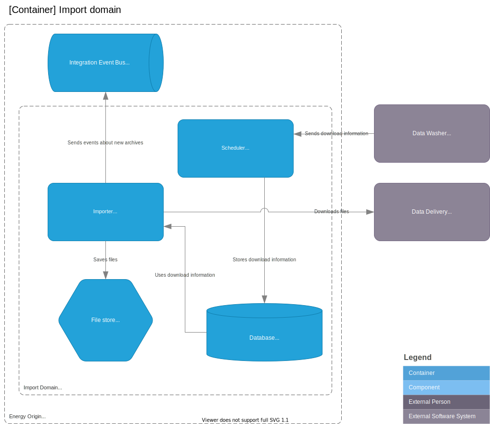

# Import Domain (proposal)

This is a **proposal** of how data could be imported from DataHub2.

It is noteworthy that the data washer and data delivery can be and is likely the same software system, but they are separated out here to clarify their respective interfaces in relation to the import domain.

## Container diagram



## Containers

Both the file store and database containers are trivial and merely present for clarity.

### Scheduler

The scheduler (container) has a public API endpoint that can receive information about new data available for downloading. The endpoint could receive JSON with the following content:

```json
{
    "uri":"https://example.com/data/delivery/identifier",
    "token":"a-token-associated-with-that-identifier"
}
```

The scheduler could be registered as a receiver in the data washer/delivery systems along with the importers public key.

### Importer

The importer (container) contains a public/private key pair that is used for authentication. The container could be run on as CRON job or with an internal reoccuring job.

The importers job is to download and archive new data. Downloading could be authenticated by public/private key signing a message containing the `token` value and sending that message as a header when downloading the given `uri`.

The importer should create archives where the data from the data washer/delivery systems are saved in a format that is suited for mass-importing into the time-series domain.

### Bus

The purpose of the Bus container is to inform every domain that needs to know, that new data is available.
