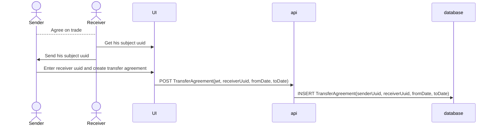
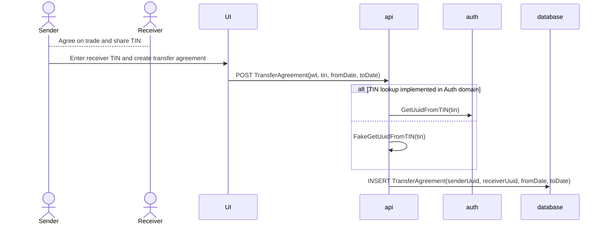

# Transfer Agreements Domain

# Decision records

## Domain

Date: 2023-05-05

We have to decide where to place the functionality.

Options:

- Part of certificates domain
- Create a new domain
- Deployed as its own system outside of energioprindelse

### Decision

We decided to create a new domain.

It appears to be its own functionality building on top of what the certificates domain enables. Furthermore, this will provide a way of using the certificates API for the matching engine using the transfer agreements (aka. dogfooding) and could also be used as part of the documentation of the certificates API.

Deploying this as its own system will require a lot of work and we will immediately hit issues with using energioprindelse's public APIs.

## Data store

Date: 2023-05-11

We need a data store.

Options:

- MartenDB (Event Store)
- MartenDB (Document Store)
- Postgres + EF Core

### Decision

Postgres + EF Core because it is simpler and more known

## Identification of receving party

Date: 2023-05-11

The sender must be able to identify the receiving party. At the moment, this is not supported in our solution (e.g. a service where you can search for other users).

Below is the considered options of how to solve this. To limit the scope of the work involved in getting the first working solution developed, we are not considering solutions that requires approval from both sender and receiver before the agreement is active.

### Option A: Solution based on Subject UUID

Pros:

- Will work in all environments

Cons:

- The subject UUID will have to be shared
- Bad UX
- The UI must be able to show the subject UUID
- Requires that the receiver has logged in to energioprindelse.dk
- Moving away from this solution would require a breaking change in the API

## Option B: Solution based on TIN/CVR

Pros:

- Better UX - sender only have to identify receiving party with TIN/CVR
- No breaking changes expected to API when evolving the solution

Cons:

- Functionality must be developed in Auth domain
- As long as functionality is not developed in Auth domain, this will only work in preview-environments for the predefined personas
- Requires that the receiver has logged in to energioprindelse.dk (unless the Auth domain has a "pre-generate a subject UUID for a TIN"-functionality)

### Decision

We go with option B because breaking change to the API is not expected, which also mean that the UI input form does not have to re-written.
