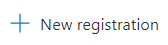
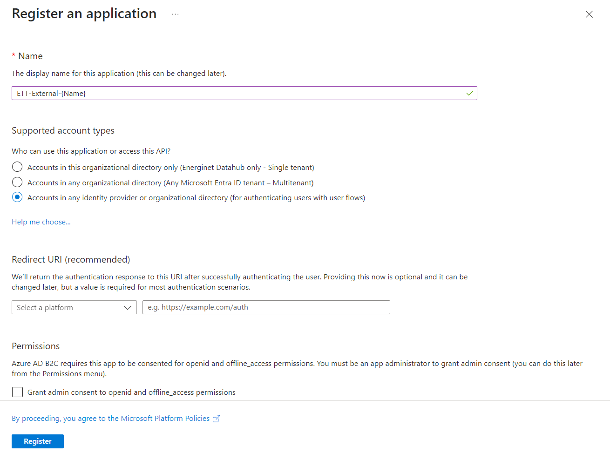
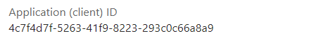
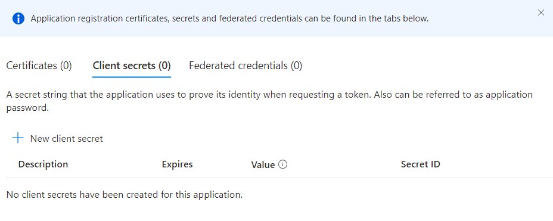
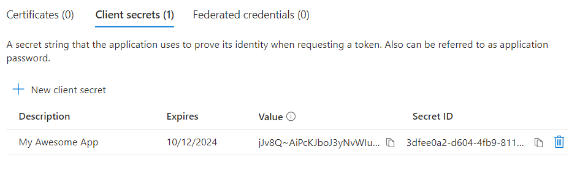

# Onboarding 3rd party Clients to ETT

This is a small document describing how we want to manually onboard 3rd party clients to Energy Track and Trace. This could be companies like Flexidao or Granular. There are two versions of the onboarding process below. Too Long Didn't Read version and Detailed with screenshots guide

A client can be created as a normal-client or a trial-client. A normal-client has access to normal organizations and a trial-client has access to trial organizations.

A customer can be provided with both client types (they will have different ids/secrets).

## TLDR Version

Onboarding clients to Demo:

* Goto <https://portal.azure.com/#view/Microsoft_AAD_B2CAdmin/TenantManagementMenuBlade/~/registeredApps> (Remember to be on Developer tenant - datahubeo**u**energinet and not datahubeo**p**energinet)
* Create new client registration with name ett-external-{Name}
* Insert customer into Authorization Database.
  * **Here you have to choose if the client should be a normal-client or a trial-client**
    * Run: doc\onboarding-create-client-normal.rest (to make admin call to create a new client)
    * Run: doc\onboarding-create-client-trial.rest (to make admin call to create a new client)
* Add Client Secret with expire date of default 6 months
  * Note down Client Secret (value field.)
* Test that your newly created client works
  * Run: doc\onboarding-test-client.rest (test that new client can login and that client can make call to our api's)
* Deliver Client Id + Client Secret to customer securely

Almost the same steps for Prod, just with other URL's and the **initial client secret must be set to an expiration of one month**.

At the moment we have the issue, that clients onboarded on VClusters also need to be onboarded on Demo, since Azure B2C always ask DEMO if client exists before login.

## Detailed with screenshots guide

### 1.
First we need to register the new client on azure portal. To do so, we need to go to: <https://portal.azure.com/#view/Microsoft_AAD_B2CAdmin/TenantManagementMenuBlade/~/registeredApps>

Press

to register a new client.

### 2.

Fill in the form as shown below:

We are now redirected to a page where we can see our newly created client.

Client Id can be seen on the following page:

On the same page we can click on:

to get into overview of client secrets.

### 3.

Here we can click on "New Client Secret", to create a a new client secret. The description isn't that important.

The client secret should have a **1 months expiration in production** and a 6 month expiration in production.

You will get redirected back to the prior page with the newly created secret. Copy the secret value and store it somewhere secure for now.

### 4.

With a Client ID and Client Secret we can now onboard and test to our application.

#### Creation of client

**You can create a normal-client and/or a trial-client**

A normal-client has access to normal organizations and a trial-client has access to trial organizations.

Normal:
* doc\onboarding-create-client-normal.rest
  * Use Energinet Issuer Client Credentials to login and get token
  * Use token to Create normal-client.

Trial:
* doc\onboarding-create-client-trial.rest
  * Use Energinet Issuer Client Credentials to login and get token
  * Use token to Create trial-client.

####  Test of client

* doc\onboarding-test-client-credentials.rest
  * Login as created client
  * Test client can make API calls. (Get list of consents. Will be empty Result list.)

With everything tested we just need to deliver Client ID and Client Secret to the contact person in a secure manner.
