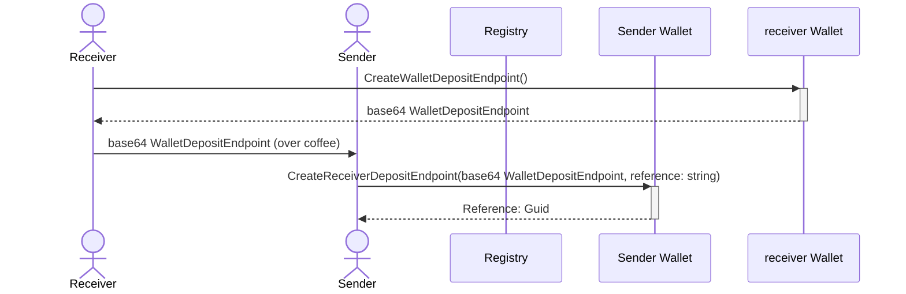
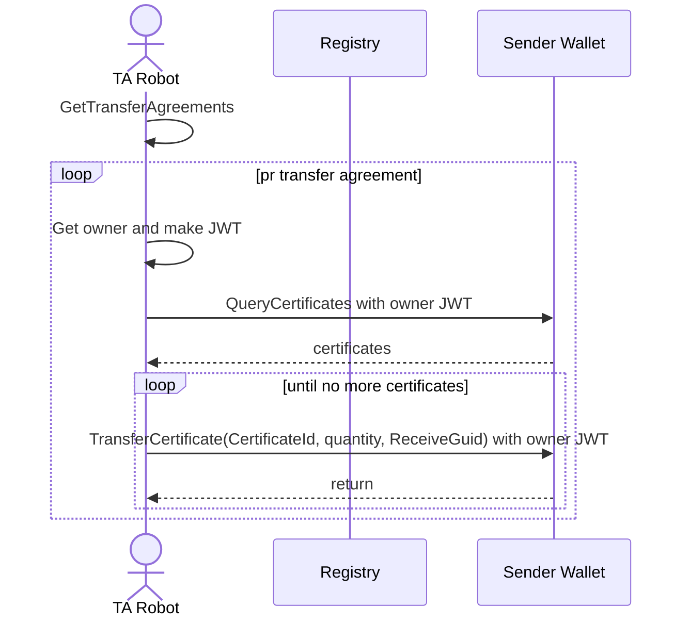

## Transfer Agreement Automation flow

wallet://mywallet.sdaugaard.dk/?exchangeToken=123515621b35252453

First the deposit endpoint is exchanged between receiver and sender. The receiver creates an endpoint in his wallet. Then a Base64 (or what we choose) encoded string of the wallet deposit endpoint is handed to the sender, which then is created on the senders wallet. A reference guid to the receiver wallet is returned to the sender which is used by the transfer automation robot.

When the wallet deposit endpoint has been exchanged the transfer agreement automation flow can begin. The TA robot gets all certificates owned and transfer them all one by one to the receiver.

