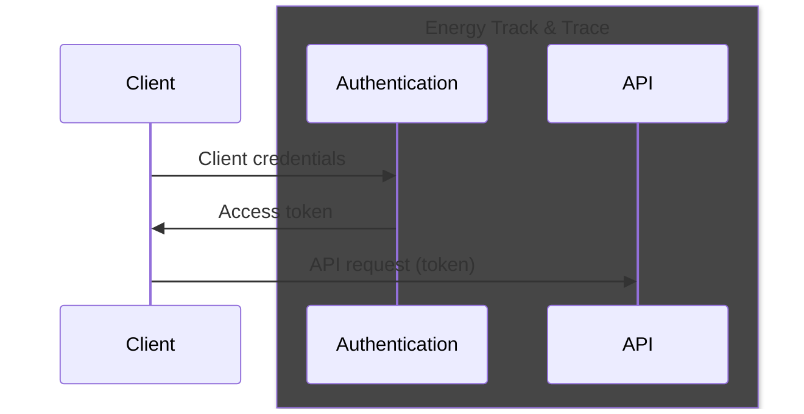
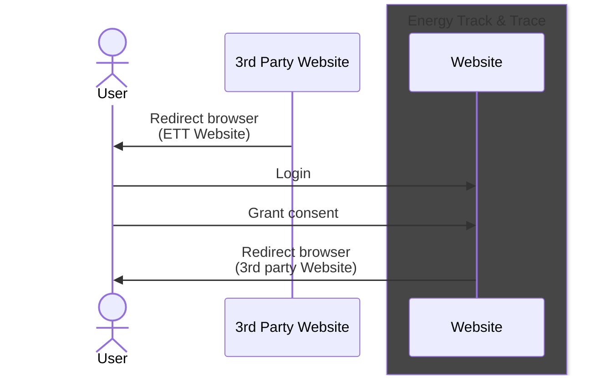

# Guide for 3rd party API usage

## Introduction

This document contains a getting-started guide on how to use the Energy Track & Trace APIs. The intended audience for this guide is developers and technical personal.

In this document code examples are shown in `C#`, and all request target the demo environment <https://demo.energytrackandtrace.dk>. Client systems in production must target the production environment <https://energytrackandtrace.dk>.

### Prerequisites

Before following this guide, you need to complete an onboarding process with Energinet Energy Track & Trace (ETT). As part of this process you will receive credentials for machine-to-machine integration. These credentials consist of a `client-id` and a `client-secret`.

The value of `client-secret` must be kept secret at all times. Use appropriate measures to store it securily while developing and deploying client systems.

It is possible to initiate a grant consent user flow on the ETT website from another website. In order for the flow to redirect the user back to the original website after granting consent, ETT will need a valid `redirect-url`. See [Consent](#consent) section. This `redirect-url` can be provided to Energinet as part of the onboarding process.

### OpenAPI

Open API specification of Energy Track & Trace API can be accessed at <https://energytrackandtrace.dk/developer/>.

## Authorization

All requests to Energy Track & Trace endpoints are authorized. All request must contain an Authorization header with a bearer token. Tokens can be obtained using a standard OAuth 2.0 `client-credentials` grant.

### Obtain access token



### C# example: Obtain access token

```csharp
var tokenEndpointUrl = "https://datahubeouenerginet.b2clogin.com/datahubeouenerginet.onmicrosoft.com/B2C_1A_ClientCredentials/oauth2/v2.0/token";

var clientId = "<client-id>";
var clientSecret = "<client-secret>";
var scope = "https://datahubeouenerginet.onmicrosoft.com/energy-origin/.default";

using var httpClient = new HttpClient();
var content = new FormUrlEncodedContent(new[]
{
    new KeyValuePair<string, string>("grant_type", "client_credentials"),
    new KeyValuePair<string, string>("client_id", clientId),
    new KeyValuePair<string, string>("client_secret", clientSecret),
    new KeyValuePair<string, string>("scope", scope)
});

using var response = await httpClient.PostAsync(tokenEndpointUrl, content);
response.EnsureSuccessStatusCode();

var responseBody = await response.Content.ReadFromJsonAsync<TokenResponse>();

var accessToken = responseBody!.AccessToken;
var accessTokenExpiryTime = DateTime.UtcNow.AddSeconds(responseBody.ExpiresIn);
```

## Consent

When making requests to the API, and accessing resources, you will need consent from the organization owning the resources. Consent is granted by a user affiliated with the organization. Consent is granted using the ETT website.

It is possible to initiate the grant consent user flow from another website. This requires a valid `redirect-url` to be registered with ETT.



In order to start the grant consent user flow, redirect the user to the following page: `https://energytrackandtrace.dk/da/onboarding?client-id=<client-id>&redirect-url=<redirect url>`. The redirect URL may contain parameters to allow state propagation. After completing the flow and granting consent, the user is redirected to `<redirect-url>`.

## API usage

All API endpoints in ETT are versioned using a header based versioning scheme. A request must contain an `EO_API_VERSION` header with a value matching the desired version of the endpoint to use.

### C# example: API request

```csharp
var token = "<access-token>"; // Access token obtained with client-credentials
var organizationId = "<organization-id>"; // Id of organization to act on behalf of

using var httpClient = new HttpClient();
using var request = new HttpRequestMessage(HttpMethod.Get, $"https://demo.energytrackandtrace.dk/wallet-api/wallets?organizationId={organizationId}");
request.Headers.Authorization = new AuthenticationHeaderValue("bearer", token);
request.Headers.Add("EO_API_VERSION", "20250101");
var response = await httpClient.SendAsync(request);
```

Refer to OpenAPI spec for a description of available API endpoints.

In the example above, an organization id is used to specify which organization to act on behalf of. The available organizations are given by the consents granted to you as a 3rd party client. A list of consenting organizations can be found with a `GET` request to `api/authorization/client/consents`, providing a valid access token that identifies you as a 3rd party client.

### C# example: Get consents

```csharp
var token = "<access-token>"; // Access token obtained with client-credentials

using var httpClient = new HttpClient();
using var request = new HttpRequestMessage(HttpMethod.Get, "https://demo.energytrackandtrace.dk/api/authorization/client/consents");
request.Headers.Authorization = new AuthenticationHeaderValue("bearer", token);
request.Headers.Add("EO_API_VERSION", "20230101");
var response = await httpClient.SendAsync(request);
```

The result should look something lige the `JSON` response below. A list of organizations that have granted you consent to act on their behalf.

```json
{
  "result":[
    { "organizationId":"645ca01a-7ddd-4d27-ba67-7abc550ce5e3", "organizationName":"Producent A/S"}]
}
```
