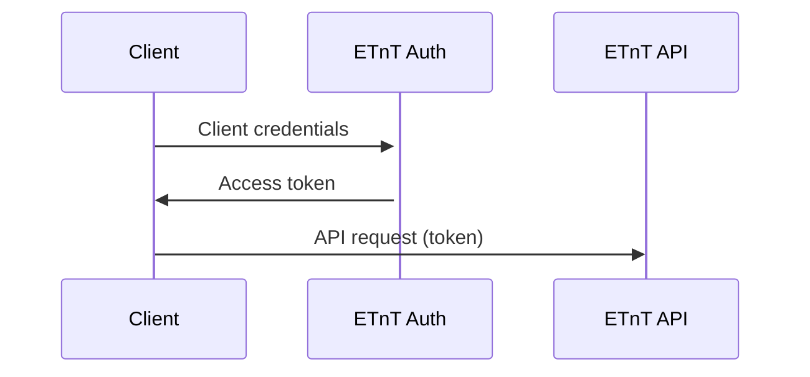

# Guide for 3rd party API usage

## Introduction 

This document contains a getting-started guide on how to use the Energy Track & Trace APIs. The intended audience for this guide is developers and technical personal.


## Prerequisites

Before following this guide, you need to complete an onboarding process with Energinet. As part of this process you will receive credentials for machine-to-machine integration. These credentials consist of a `client-id` and a `client-secret`. 

The value of `client-secret` must be kept secret at all times. Use appropriate measures to store it securily while developing and deploying client systems.


## Authorization

All requests to Energy Track & Trace endpoints are authorized. All request must contain an Authorization header with a bearer token. Tokens can be obtained using a standard OAuth 2.0 `client-credentials` grant.

### Obtain access token



### Example

```rest
@grantType = client_credentials
@clientId = <client-id>
@clientSecret = <client-secret>
@scope = https://datahubeouenerginet.onmicrosoft.com/energy-origin/.default
###

# @name tokenResponse
POST https://datahubeouenerginet.b2clogin.com/datahubeopenerginet.onmicrosoft.com/B2C_1A_ClientCredentials/oauth2/v2.0/token HTTP/1.1
Content-Type: application/x-www-form-urlencoded

grant_type={{grantType}}
&client_id={{clientId}}
&client_secret={{clientSecret}}
&scope={{scope}}

###
@accessToken = {{tokenResponse.response.body.access_token}}
```

## Consent

When making requests to the API, the a client will have to specify which organizations.


## API usage

### Versioning
