# Guide for configuring B2C tenant for Energy Origin

## Introduction

### Prerequisites

- Existing tenant
- Access rights to configure tenant

### App registrations

Create registrations for `ett-authorization-b2c` client. This client will be used by custom policies to make requests to `Authorization` service

#### B2C app registration

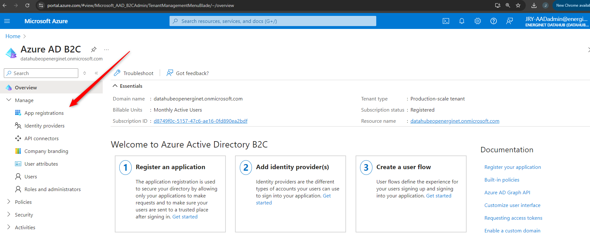

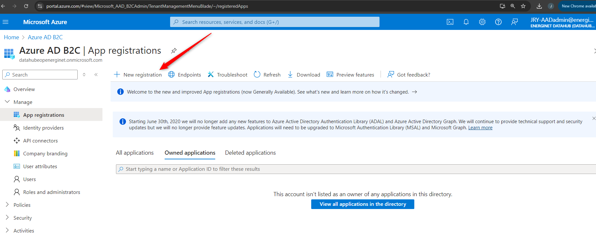

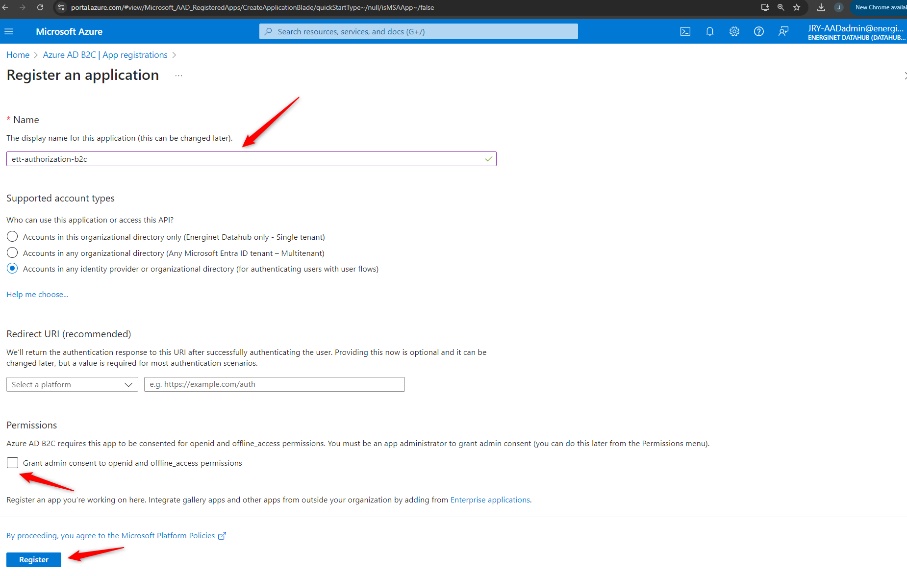

#### Add secret

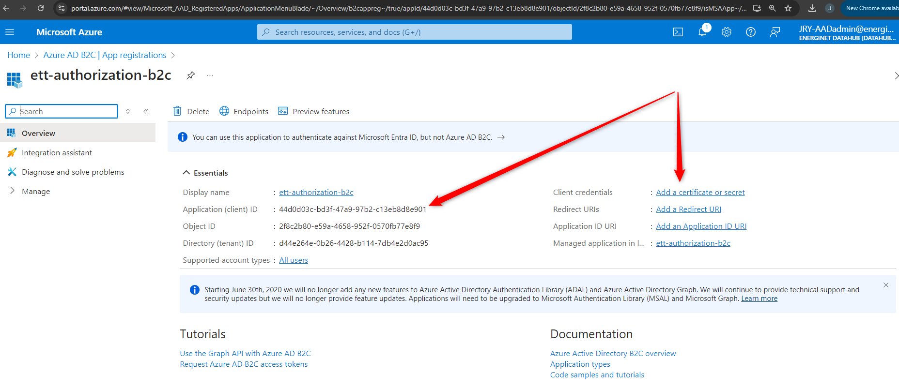

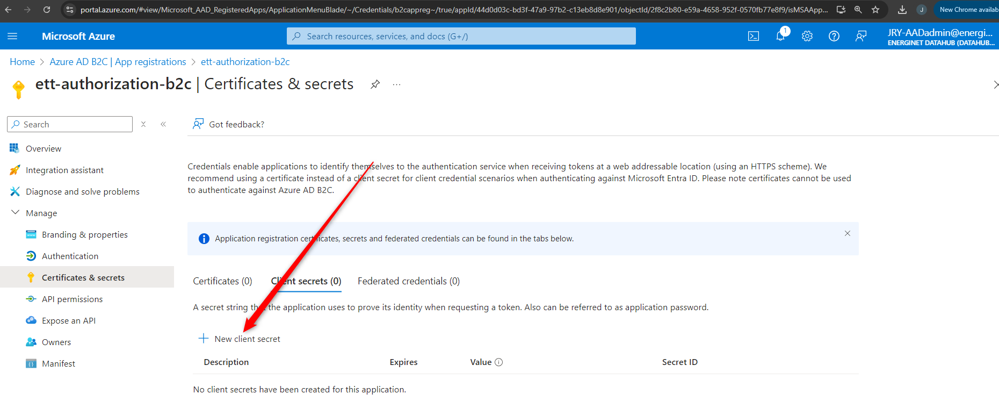

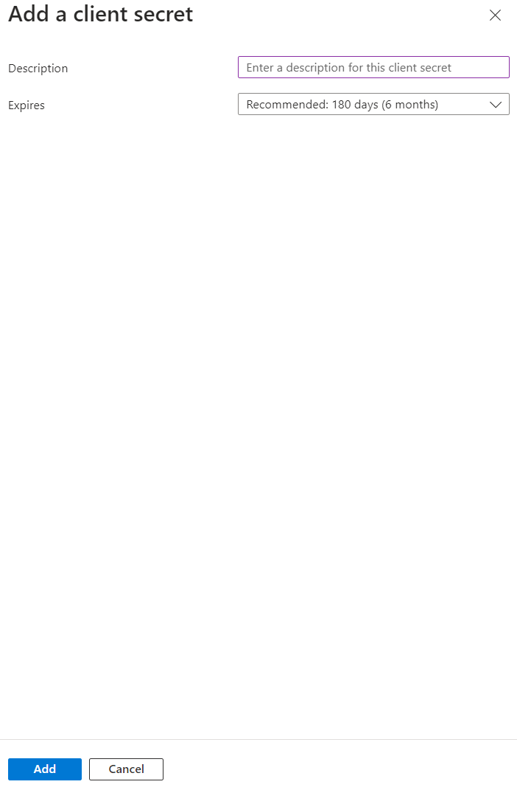

Set expire to ???

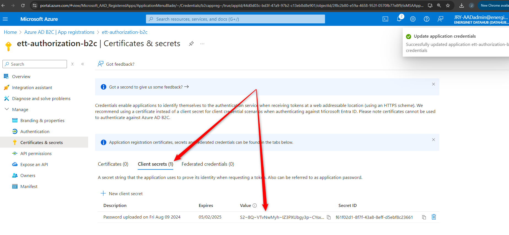

Store secret value somewhere safe

Store tenant-id and client-id.

#### Application id

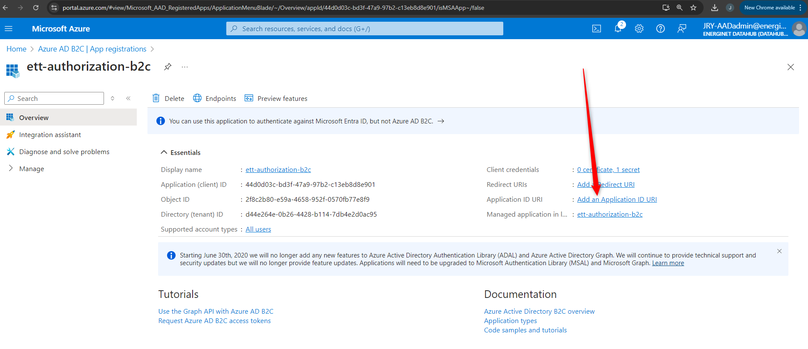

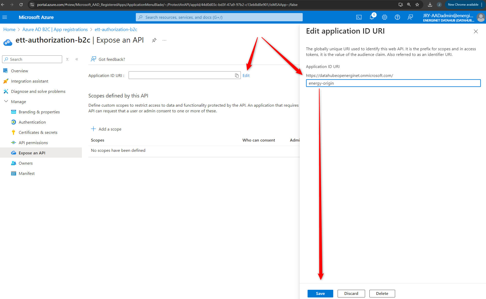

Set application id  to `energy-origin`.

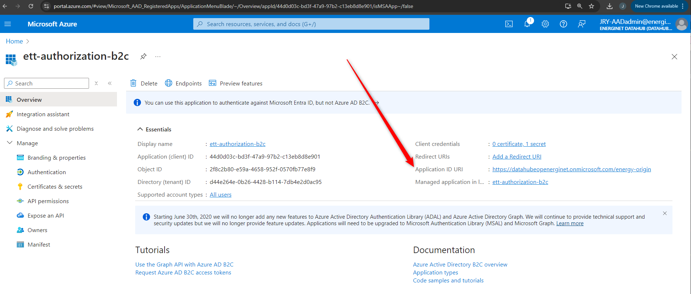

Get application id url (used in scope when performing a client credentials flow).

#### Test client credentials

```rest
@grantType = client_credentials
@clientId = <fill-in>
@clientSecret = <fill-in>
@scope = <fill-in>
@tenantId = <fill-in>
###

# @name tokenResponse
POST https://login.microsoftonline.com/{{tenantId}}/oauth2/v2.0/token HTTP/1.1
Content-Type: application/x-www-form-urlencoded

grant_type={{grantType}}
&client_id={{clientId}}
&client_secret={{clientSecret}}
&scope={{scope}}
```

#### Energy Track and Trace app registration


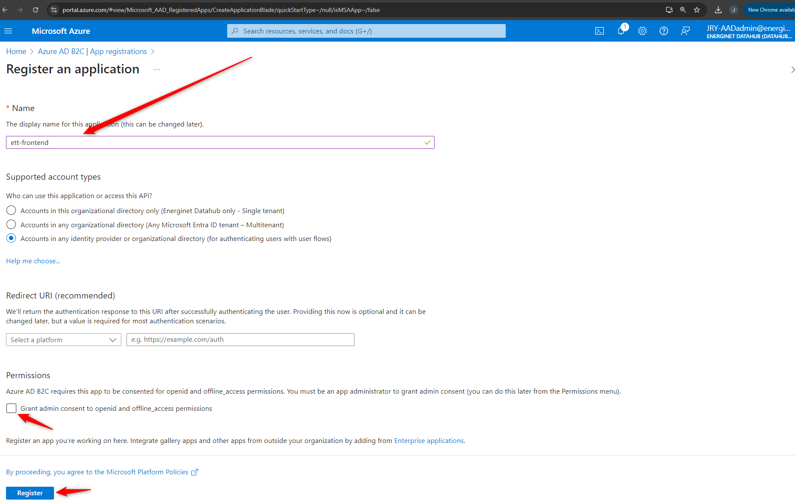

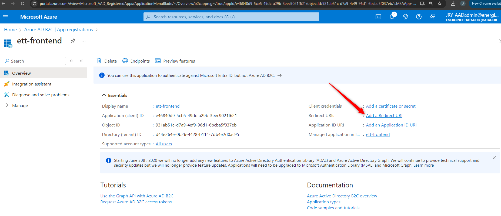

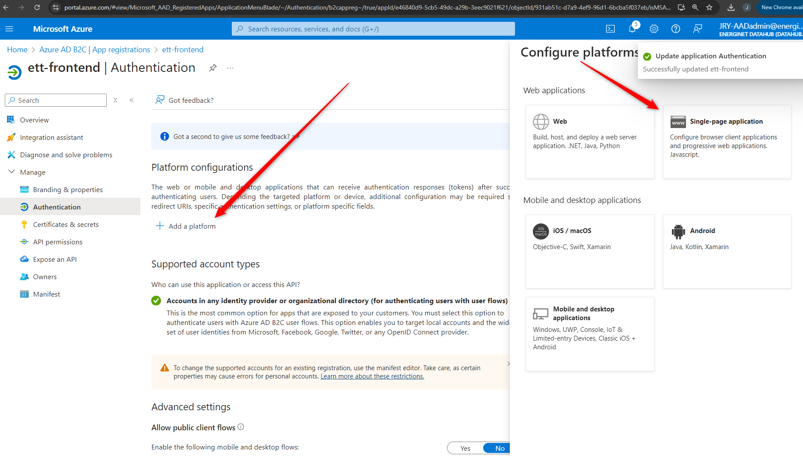

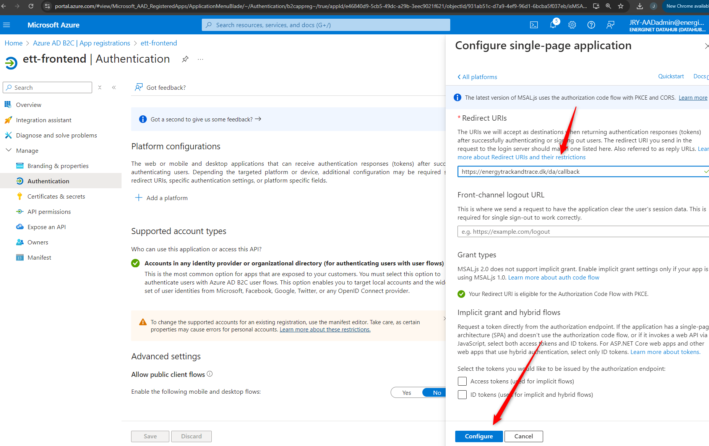

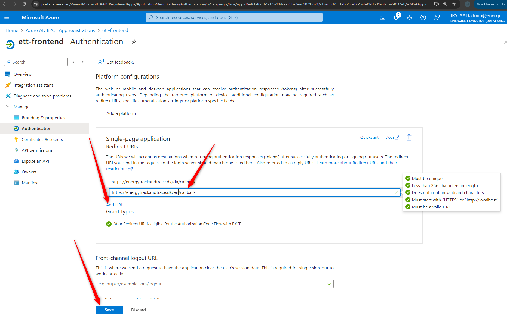

### Deploy user_info proxy

Go to `API Management services``

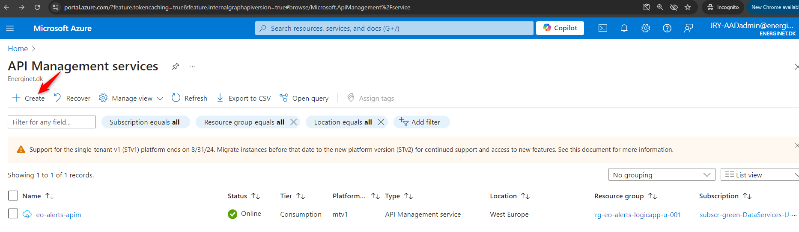

### Deploy custom policies
