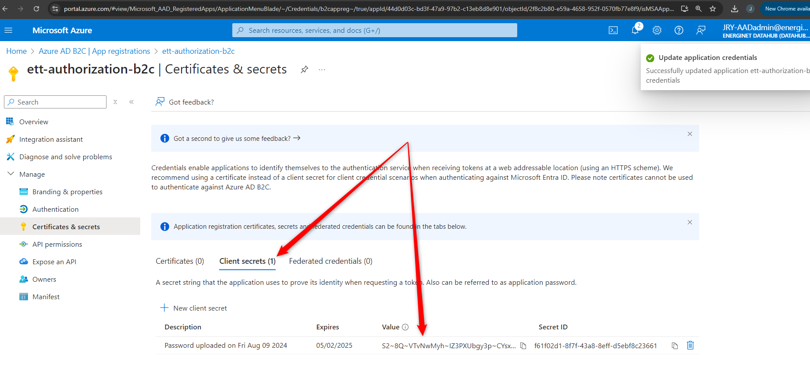
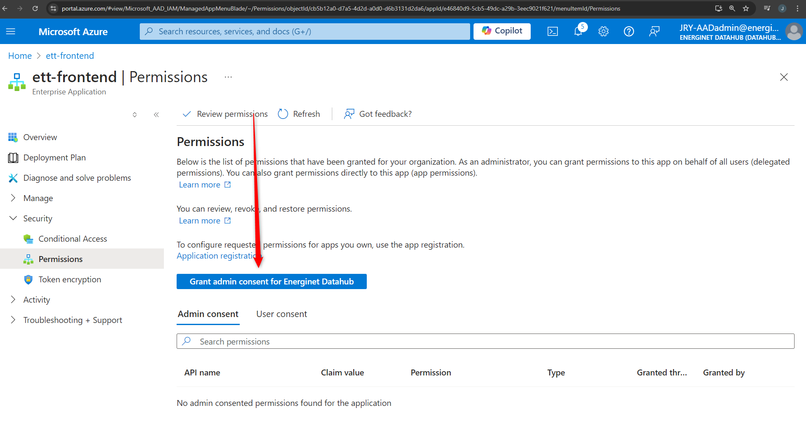

# Guide for configuring B2C tenant for Energy Origin

## Introduction

This document contains a step-by-step guide on how to configure the ETT B2C production tenant in Azure. This is needed in case we need to configure Azure B2C again, if someone deletes it by accident. Can also be used by other teams, who needs a similar setup.

### Prerequisites

The following prerequiresites must be addressed before starting the configuration.

- __Existing tenant:__ A B2C instance must be available, the current instance was created by T/I by request.
- __Invitation:__ Users must be invited to the new B2C tenant. After accepting the invitation, the user may use the switch workspace option in Azure to access the tenant.
- __Access rights:__ Users must have sufficient access rights to configure the tenant. (Currently we use the `global administrator` role)

### App registrations

#### B2C app registration

Create registration for `ett-internal-authorization-b2c` client. This client will be used by custom policies to make requests to `Authorization` service.

Navigate to `App registrations`.


Click `New registration`.


Enter `ett-internal-authorization-b2c` in `Name`. Uncheck `Grant admin consent to openid and offline_access permission` checkbox. Finally click `Register`.


The client id of the newly generated app registration is needed to configure the Authorization sub system to accept tokens when getting consent and performing admin requests. The client id when using client-credentials outside of the custom flows, is the object id of the underlying enterprise application. Navigate to the newly created app registration, and click the mananaged app link.


The object id will be used as subject in access tokens issued with client credentials. This id must be configured in the Authorization sub system.


##### Add secret

Navigate to newly created app registration. Values for tenant-id and client-id can be found on this page. These values are needed later. Click `Add a certificate or secret`.


Click `New client secret`.


Leave `Description` and `Expires` fields empty. Click `Add`.  __?!? Decide on expires value__


The generated secret value will not be available later. Make sure to copy the value now and store it somewhere secure.



##### Application id

Add an application id to the newly registered application. Click `Add an Application ID URI`.


Click `Edit` and enter `energy-origin` in the application id field. Click `Save`.


Get application id url (used in scope when performing a client credentials flow).


##### Test client credentials

Test client-credentials flow is working for the newly created app registration. The following REST script can be modified to perform the test. Fill in the missing values aquired previously in this guide.

```rest
@grantType = client_credentials
@clientId = <fill-in>
@clientSecret = <fill-in>
@scope = <fill-in>
@tenantId = <fill-in>
###

# @name tokenResponse
POST https://login.microsoftonline.com/{{tenantId}}/oauth2/v2.0/token HTTP/1.1
Content-Type: application/x-www-form-urlencoded

grant_type={{grantType}}
&client_id={{clientId}}
&client_secret={{clientSecret}}
&scope={{scope}}
```

#### Energy Track and Trace app registration

Create an app registration for Energy Track & Trace frontend. This app registration will be used by the frontend application to authenticate users. Navigate to `App registrations`  and click `New registration`.


Provide name `ett-frontend`. Uncheck `Grant admin consent to openid and offline_access permission` checkbox. Finally click `Register`.


Click `Add a redirect URI`.


Choose `Single-page application` as platform.


Add the Energy Track & Trace URL `https://energytrackandtrace.dk/da/callback` as redirect URL. Click `Configure`.


Add a second redirect URL `https://energytrackandtrace.dk/en/callback` to the list, and click `Save`.


Add API permission to allow user sign-in for this specific app. Navigate to `App registration` and `API permissions`.

Add permissions to app registration.


Grant admin consent to permissions.



#### Authorization app registration

Create the app registration `ett-internal-authorization-secrets`. This client will be used by the Authorization subsystem to call the Microsoft Graph API.

Specificially it will be used to get/create/delete secrets in app registrations for third-party clients.

Navigate to `App registrations`.


Click `New registration`.


Enter `ett-internal-authorization-secrets` in `Name`.

Under `Supported account types`, choose `Accounts in this organizational directory only (Single tenant)`.

Uncheck `Grant admin consent to openid and offline_access permission` checkbox. Finally click `Register`.


##### Add secret

Navigate to newly created app registration. Values for tenant-id and client-id can be found on this page. These values are needed later. Click `Add a certificate or secret`.


Click `New client secret`.


Give the secret a `Description` and set `Expires` to two years in the future (maximum expiration). Click `Add`.


The generated secret value will not be available later. Make sure to copy the value now and store it somewhere secure.


##### Add API permission

Navigate to `API permissions`.


Click `Add a permission` and select `Microsoft Graph`.


Click `Application permissions` and add the permission `Application.ReadWrite.All`.


Grant admin consent to the newly added permission.


##### Test client credentials

Test that it's possible to get an access-token that can be used for the Microsoft Graph API. The following REST script can be modified to perform the test. Fill in the missing values aquired previously in this guide.

```rest
@grantType = client_credentials
@clientId = <fill-in>
@clientSecret = <fill-in>
@scope = https://graph.microsoft.com/.default
@tenantId = <fill-in>
###

# @name tokenResponse
POST https://login.microsoftonline.com/{{tenantId}}/oauth2/v2.0/token HTTP/1.1
Content-Type: application/x-www-form-urlencoded

grant_type={{grantType}}
&client_id={{clientId}}
&client_secret={{clientSecret}}
&scope={{scope}}
```

##### Seal secret and add to Authorization sub system

Seal the secret from the app registration using the [how-to guide](https://github.com/Energinet-DataHub/eo-base-environment/blob/main/docs/guides/how-to-seal-a-secret.md).

- name: `b2c-appregistration-secrets`
- namespace: `eo`
- secret-key name: `ETT_INTERNAL_AUTHORIZATION_SECRETS_SECRET`

Add the sealed secret to the specific Authorization sub system environment in the repository `eo-base-environment`.

##### Add AzureAd data to configmap

Add the following data to the specific Authorization sub system environment configmap (`authorization-cm`), in the repository `eo-base-environment`.

- AzureAd__Instance: https://login.microsoftonline.com/
- AzureAd__ClientId: `<fill-in>`
- AzureAd__TenantId: `<fill-in>`
- AzureAd__ClientCredentials__0__SourceType: ClientSecret

### Deploy custom policies

#### MitID Client Secret

Client secret for MitID integration must be securily stored as a secret in Azure. The secret is referenced by the MitID custom policy deployed later in this guide.

Navigate to `Identity Experience Framework`.


Navigate to `Policy keys`.


Add a new secret value. The value must match the secret configured with the MitID provider. Click `Add`. Choose `Manual`, enter name `B2C_1A_MitIDSecret` and provide the secret value in the Secret input field. Key usage must be set to `Signature`.


#### Token Signing Secret

Add secrets used for signing tokens. In the `Policy keys` view, click `Add.`. Choose `Generate`, fill in name `B2C_1A_TokenEncryptionKeyContainer` and choose Key Type `RSA`. Key usage must be set to `Signature`.


#### Token Encryption Secret

Perform the same steps as in [link text](#token-signing-secret). Name should be set to `B2C_1A_TokenEncryptionKeyContainer` instead.


#### Policies

The following custom policies must be uploaded to B2C.

- domains/authorization/custom_policies/production/B2C_1A_MitId.XML
- domains/authorization/custom_policies/production/B2C_1A_ClientCredentials.XML

First step is to replace GUIDs and URLs in the custom profiles. The relevant GUIDs and URLs to be replaced are marked with XML comments in the files.


Notice that it's not possible to test the custom policy from the Azure portal without added a web redirect in the frontnend app registration.

To test the login, add a web application to the ett frontend app with redirect URL `https://jwt.ms`. The login can then be tested, however claims mapping cannot be tested because the app registration does not allow tokens for implicit flow.


Test the custom policy login.


#### eo-base configuration

Eo-base configuration needs to be updated. Modify `k8s\energy-origin-apps\authorization\shared\resources\production\authorization-configmap.yaml` with values for
