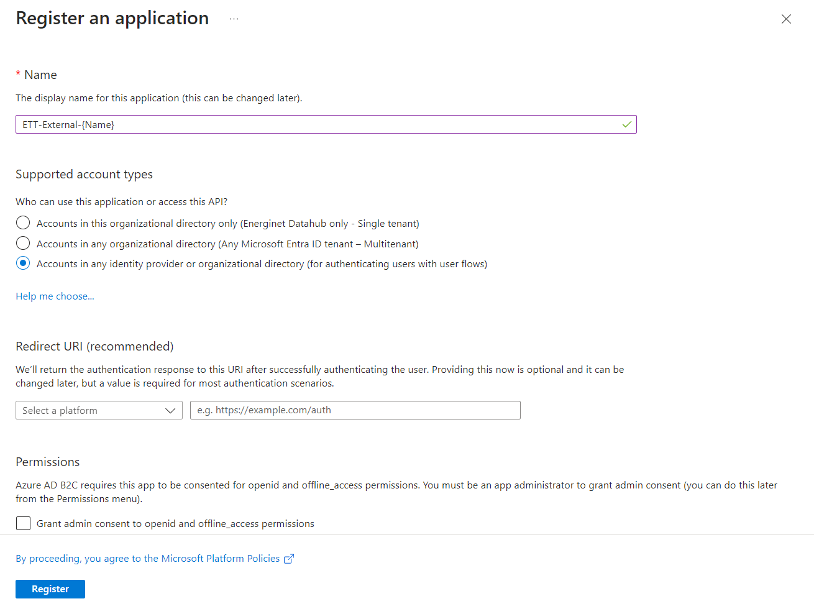
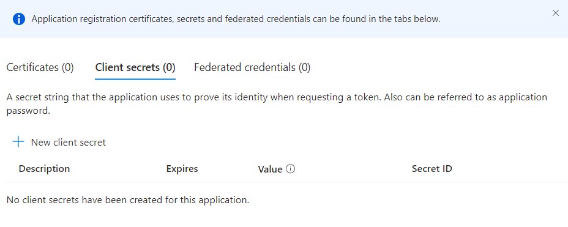
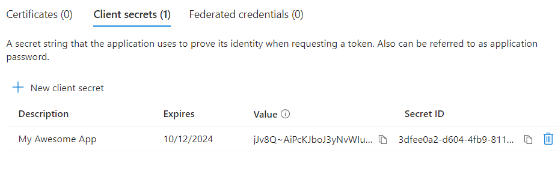

# Onboarding 3rd party Clients to ETT

This is a small document describing how we want to manually onboard 3rd party clients to Energy Track and Trace. This could be companies like Flexidao or Granular. Broad overview of the process would be like the following:

* Goto https://portal.azure.com/#view/Microsoft_AAD_B2CAdmin/TenantManagementMenuBlade/~/registeredApps
* Create new client registration with name ETT-External-{Name}
    * Note down Client ID
* Add Client Secret with expire date of default 6 months
    * Note down Client Secret (value field.)
* Test that your newly created client works
    * Run: samples\Scripts\client-credentials.rest
* Deliver Client Id + Client Secret to customer securely

Details with screenshots:

First we need to register the new client on azure portal. To do so, we need to go to: https://portal.azure.com/#view/Microsoft_AAD_B2CAdmin/TenantManagementMenuBlade/~/registeredApps

press

to register a new client.

Fill in the form as shown below:

We are now redirected to a page where we can see our newly created client.

Client Id can be seen on the following page:

On the same page we can click on:

to get into overview of client secrets.

Here we can click on "New Client Secret", to create a a new client :P secret description, isn't that important and we will stick with default 6 months expire date for now.

You will get redirected back to prior page with the newly created secret. Copy secret value and store it somewhere secure for now.

With the newly created secret you should be able to test a login with our .REST scripts at:

samples\Scripts\self-client-credentials copy.rest

Replace client ID and Client Secret and test out the script to get a bearer token and after calling the endpoint to get consents. The endpoint should just return an empty list. This will test A) we can get an bearer token for client credentials and B) We are able to call an API and get access.

With everything tested we just need to deliver Client ID and Client Secret to the contact person in a securely manor.

