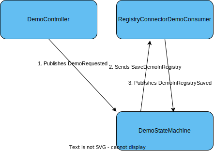

# Certificates Domain
This is the certificates domain.

## For local development
In order to test and develop locally, enter the docker-test-env and run:
```
docker-compose up
```
When shutting down, run:
```
docker-compose down --volumes
```

## Domain decisions / DDR (Domain-decision-records)

* Use MassTransit to have an abstraction on top of message transports such as RabbitMQ. It can also use Marten for saga persistence. For now it is used as in-memory bus for integration events.
* Use MartenDB for event store.
* FluentValidation to make assertions in test more readable. Furthermore, FluentAssertions has support for "BeEquivalentTo", see https://fluentassertions.com/objectgraphs/.


## Demo Workflow

Below is how the messages flow for the demo workflow. Please notes that events are published and commands are sent.



The orchestration saga is a MassTransit State Machine. Below is a diagram of the states. A MassTransit State Machine will always have the states Initial and Final; all other states are defined specifically (e.g. "Processing" below).


The main reason for using a MassTransit State Machine is to report a status. This is done with MassTransit's request client, that sends the request `DemoStatusRequest` and will get either a `DemoStatusResponse` or `NotFoundResponse` as a response.
